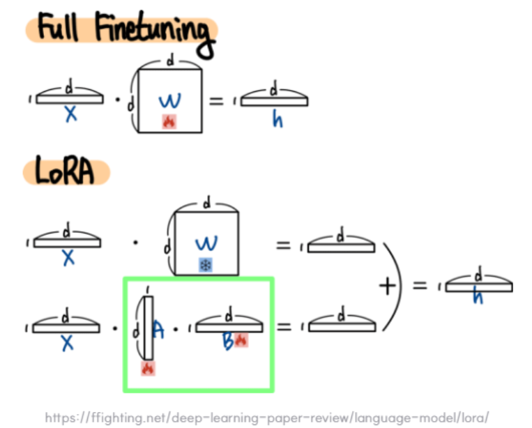
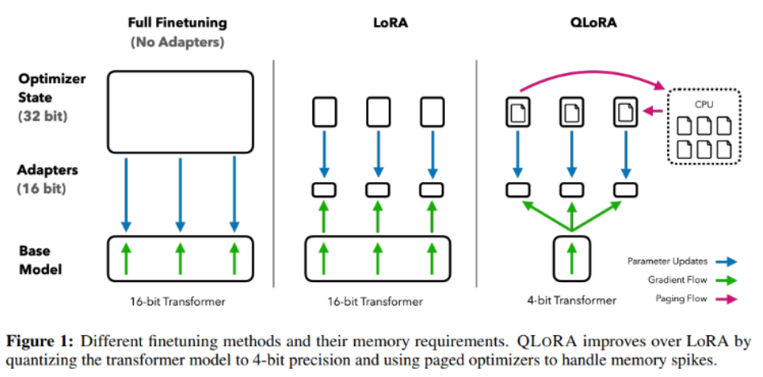

# [LoRA - Low Rank Adaptation](https://beeny-ds.tistory.com/entry/LORA-%EB%85%BC%EB%AC%B8-%EC%89%BD%EA%B2%8C-%EC%84%A4%EB%AA%85%ED%95%98%EA%B8%B0)
- Low-rank adaption(LoRA)은 Low-rank factorization 방법을 활용하여 LLM의 linear layer에 대한 업데이트를 근사화하는 기술이다.
- 이는 훈련 가능한 매개 변수의 수를 크게 줄이고 모델의 최종 성능에 거의 영향을 주지 않으면서 훈련 속도를 높인다.

---
## Full Finetuning vs LoRA


---
## LoRA 학습방법 
- (파랑색) Pretrained Weights는 학습하지 않음 
- (빨강색) LoRA Layer(`nn.linear`) 학습 진행 


---
1. Fully Fine-Tuning 하지 않음 
2. Model weight를 Freeze 함 
3. 학습하는 Layer는 LoRA_A & LoRA_B 이다. (둘다 nn.linear 모델)
4. Transformer Layer에 있는 Query, Key, Value, Output(=self attention) 중 선택하여 (LoRA_A * LoRA_B)를 단순히 더해줌 

> 즉, Model weight를 freeze 하지만 Inference 시 사용되는 weight 값은 update가 된다. Model weight에 (LoRA_A * LoRA_B)를 더해줬기 때문이다.

---
## LoRA 장점
 
| | 기존 fine-tuning | LoRA |
|---|---|---|
| 학습 파라미터 수 | 전체 (수십억) | 극히 일부 (1~5%) |
| GPU 메모리 | 매우 많이 필요 | 훨씬 적게 필요 |
| 학습 속도 | 느림 | 빠름 |
| 원본 모델 보존 | 변경됨 | 그대로 유지 |

---
# [QLoRA (Quantized Low-Rank Adaptation)](https://velog.io/@kaiba0514/QLoRA-QLoRA-Efficient-Finetuning-of-Quantized-LLMs)
LoRA에 양자화(Quantization)를 더해서, 더 적은 메모리로 대형 모델을 fine-tuning하는 기술



---
## 핵심 개념: 양자화(Quantization)란?
> 숫자를 표현하는 **정밀도를 낮춰서** 메모리를 줄이는 기법
 
```
기존 (FP16, 16비트):  3.14159265...  → 메모리 많이 사용
양자화 (4비트):       3.1            → 메모리 훨씬 적게 사용
```
 
정밀도가 낮아지니 약간의 성능 손실이 있지만, QLoRA는 이를 최소화했습니다.

---
## QLoRA의 3가지 핵심 기술
 
### 1. 4비트 양자화 (NF4)
- 모델 가중치를 **4비트**로 압축 저장
- 일반적인 4비트보다 정보 손실이 적은 **NF4(NormalFloat4)** 형식 사용
 
### 2. 이중 양자화 (Double Quantization)
- 양자화에 쓰이는 상수값도 한 번 더 양자화
- 파라미터당 추가로 **0.37비트** 절약 (티끌 모아 태산!)
 
### 3. 페이지드 옵티마이저 (Paged Optimizer)
- GPU 메모리가 부족하면 **CPU 메모리를 임시로 활용**
- 메모리 부족으로 학습이 멈추는 현상 방지

---
## 얼마나 효율적인가?
 
| | 기존 fine-tuning | LoRA | QLoRA |
|---|---|---|---|
| 65B 모델 학습 시 필요 GPU | A100 × 수십 장 | A100 × 수 장 | **A100 1장** (80GB) |
| 소비자용 GPU 가능 여부 | ❌ | 어려움 | (RTX 3090 등) |
| 성능 손실 | 없음 (기준) | 거의 없음 | 매우 적음 |

> 집에 있는 고사양 게이밍 PC로도 대형 모델 학습이 가능

---
## LoRA vs QLoRA 한눈에 비교
 
```
LoRA  = 원본 모델(FP16) + 작은 어댑터 학습
QLoRA = 원본 모델(4비트 압축) + 작은 어댑터 학습 (어댑터는 FP16 유지)
```
- **LoRA** = 큰 모델은 냅두고 작은 어댑터만 학습
- **QLoRA** = 큰 모델을 **4비트로 압축**하고 작은 어댑터만 학습 → 메모리 절약 극대화!

