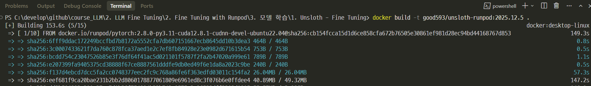

# [Unsloth](https://unsloth.ai/)
- Unsloth는 거대 언어 모델(LLM)의 파인튜닝(Fine-tuning) 속도를 획기적으로 높이고 메모리 사용량을 줄여주는 오픈소스 라이브러리입니다. 
- 특히 개인용 GPU를 사용하는 학생이나 연구자들에게 매우 유용한 도구입니다.

---
## Unsloth 장점
일반적으로 LLM을 학습시키려면 엄청난 양의 VRAM(그래픽 메모리)과 시간이 필요합니다. Unsloth는 이를 수학적으로 최적화하여 다음과 같은 이점을 제공합니다.

- `압도적인 속도`: 기존 Hugging Face 방식보다 2배~5배 더 빠른 학습 속도.
- `메모리 효율성`: 메모리 사용량을 70% 이상 절감. (고성능 GPU가 없어도 학습 가능!)
- `손실 없는 정확도`: 속도는 빨라지지만, 모델의 예측 정확도는 전혀 떨어지지 않습니다 (0% Accuracy Loss).
- `초보자 친화적`: 코랩(Google Colab)에서도 단 몇 줄의 코드로 실행 가능합니다.

---
## 성능 비교 (Llama-3 8B 모델 기준)

| 비교 항목 | 기본 방식 (Hugging Face) | **Unsloth 적용 시** |
| :--- | :--- | :--- |
| **학습 시간** | 10시간 | **약 2~3시간** |
| **메모리(VRAM) 점유** | 16GB 이상 | **약 7GB 미만** |
| **정확도** | 100% | **100% (차이 없음)** |

---
## Unsloth LoRA / QLoRA 장점

| 관점           | 장점                  | 설명                                  |
| ------------ | ------------------- | ----------------------------------- |
| 속도        | **학습 속도 매우 빠름**     | 커스텀 CUDA 커널 + 최적화된 forward/backward |
| 메모리       | **VRAM 사용량 최소**     | 4bit 로딩 + QLoRA 기본 설계               |
| 난이도       | **설정이 단순함**         | YAML 없음, Python 몇 줄로 끝              |
| 실험        | **빠른 반복 실험 가능**     | 하이퍼파라미터 변경 부담 낮음                    |
| 하드웨어      | **단일 GPU로 충분**      | 24GB GPU에서도 7B~13B 가능               |
| 통합        | **Transformers 호환** | HF Trainer / PEFT 생태계 그대로 사용        |
| 저장        | **HF Hub 업로드 간단**   | `push_to_hub()` 바로 가능               |
| 디버깅       | **에러 지점 명확**        | 분산/ZeRO 개념 없음                       |

---
# Unsloth - Fine Tuning 

---
## Dockerfile에 포함된 필수 요소
> RunPod에서 모델 학습 → Hugging Face Hub 저장

| 기능       | 라이브러리             | 상태 |
| -------- | ----------------- | -- |
| 모델 로딩/학습 | `unsloth`         | ✅  |
| HF 모델 구조 | `transformers`    | ✅  |
| QLoRA    | `bitsandbytes`    | ✅  |
| Trainer  | `trl`, `peft`     | ✅  |
| Hub 업로드  | `transformers` 내부 | ✅  |

---
## Docker Hub에 배포

---
### 단계1: Docker Image 생성
```shell
docker build -t <Docker ID>/unsloth-runpod:2025.12.5 .
```


---
### 단계2: (옵션)Docker Container 실행 
```shell
# GPU용
docker run -it --rm --gpus all -p 8080:8080 -v ./workspace:/workspace <Docker ID>/unsloth-runpod:2025.12.5
# CPU용
docker run -it --rm -p 8080:8080 -v ./workspace:/workspace <Docker ID>/unsloth-runpod:2025.12.5
```


---
### 단계3: Docker Hub 배포 
```shell
docker push <Docker ID>/unsloth-runpod:2025.12.5
```


---
## Runpod


---
### 단계1:  


