# [LLaMA Factory](https://llamafactory.readthedocs.io/en/latest/)
- **LLaMA Factory**는 대형 언어 모델(LLM)을 **쉽고 빠르게 파인튜닝(Fine-tuning)** 할 수 있게 도와주는 오픈소스 프레임워크입니다.   
- "코드 거의 없이, GUI 또는 간단한 명령어만으로 LLM을 내 데이터로 학습시키는 도구"

---
## 왜 쓰는가?
| 기존 방법(Hugging Face 등) | LLaMA Factory |
|---|---|
| 복잡한 코드 작성 필요 | 설정 파일 또는 WebUI로 해결 |
| 각 모델마다 다른 설정 | 100+ 모델을 통합 지원 |
| GPU 메모리 최적화 어려움 | QLoRA 등 자동 지원 |

---
## 주요 특징
- **모델**: LLaMA, Mistral, Qwen, Gemma, Phi, ChatGLM 등 100개 이상
- **학습 방식**:
  - Full Fine-tuning (전체 학습)
  - **LoRA** / **QLoRA** / **DoRA** 
  - RLHF (보상 기반 강화학습)
  - DPO, PPO, ORPO 등 최신 기법
- **인터페이스**:
  - WebUI (클릭으로 조작)
  - CLI (명령어)
  - Python API

---
# [WebUI](https://llamafactory.readthedocs.io/en/latest/getting_started/webui.html)

---
## DoRA (Weight-Decomposed LoRA)란?
- DoRA는 모델의 가중치를 **크기(Magnitude)** + **방향(Direction)** 으로 분해하여 학습하는 방식
- **장점**: 
  - Full Fine-tuning과 유사한 성능
  - 더 적은 GPU 메모리 사용

---
### DoRA 작동 방식
> DoRA는 LoRA에 두 가지 트릭을 추가한 구조
1. **Per-column Normalization**: 행렬의 각 열(column)을 **개별적으로 정규화**
2. **Per-column Rescale Vector**: 각 열에 대한 스케일링 벡터(m)를 별도 학습

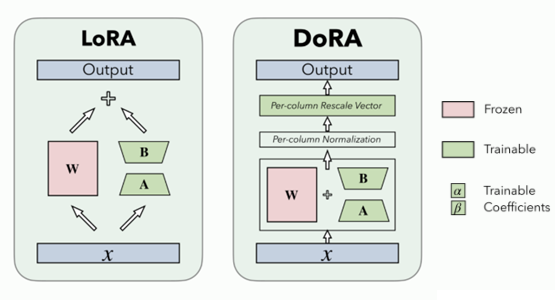

---
### LoRA vs DoRA
| 항목 | LoRA | DoRA |
|------|------|------|
| 방식 | 저랭크 행렬 추가 | 가중치를 크기(magnitude) + 방향(direction)으로 분해 |
| 성능 | 효율적이지만 Full FT와 차이 있음 | Full Fine-tuning에 더 근접 |
| GUI 설정 | Fine-tuning Method: LoRA | LoRA 선택 후 **"Use DoRA" 체크** |

---
> DoRA 설정 예시

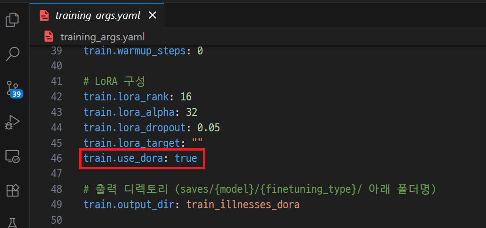

---
## Docker
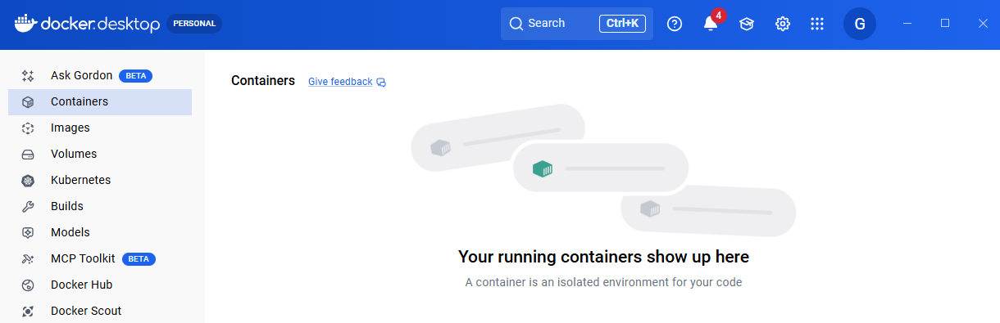

---
### 단계1: Docker 이미지 빌드
```bash
docker build --platform linux/amd64 -t [YOUR_USERNAME]/llamafactory-gui-runpod:0.9.2 .
```
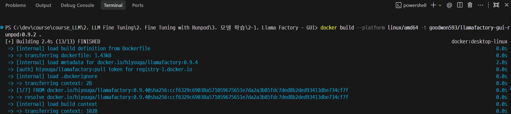

---
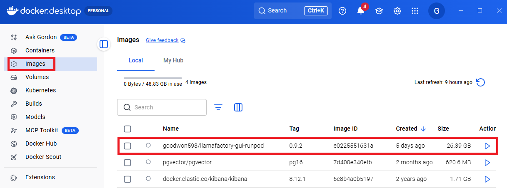

---
### 단계2: Docker Hub 배포
```bash
docker push [YOUR_USERNAME]/llamafactory-gui-runpod:0.9.2
```
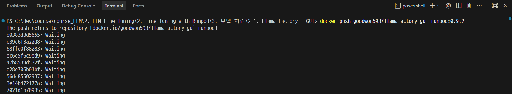

---
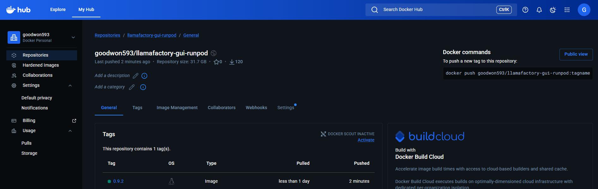

---
## Runpod 모델 학습

---
### [단계1: GPU Pod 생성](https://console.runpod.io/deploy)
- RTX 5090 → Blackwell(sm_120) → 0.9.4 이미지와 호환 안됨
- 그 외 모든 GPU(RTX 3090, RTX 4090 (24GB)) → Ampere/Ada 계열 → 0.9.4 이미지로 DoRA 포함 정상 작동

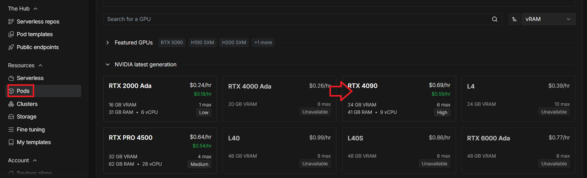

---
> Configure deployment

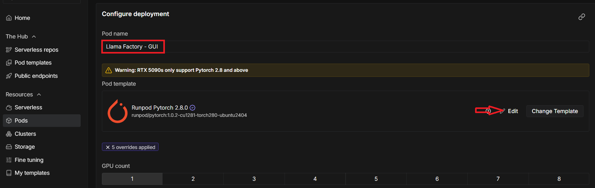

---
> Pod template overrides 

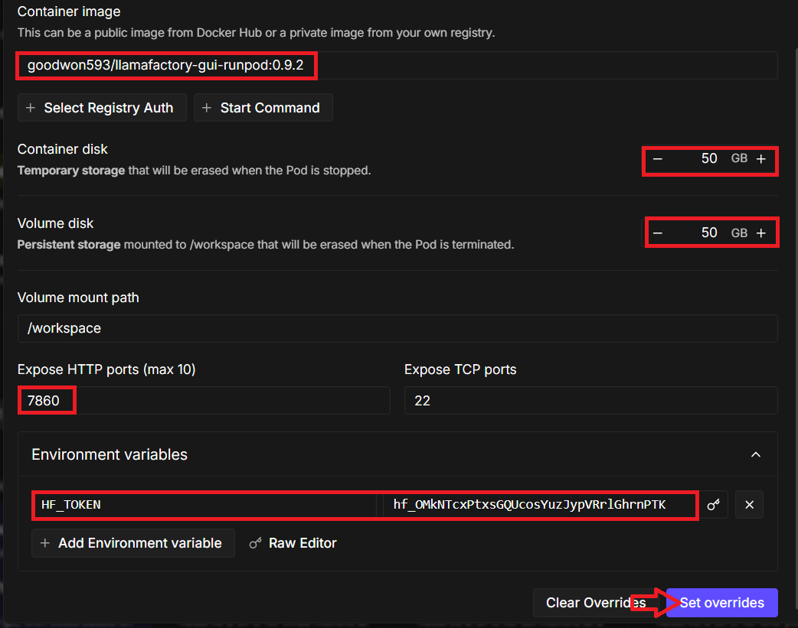

---
> Deploy On-Demand

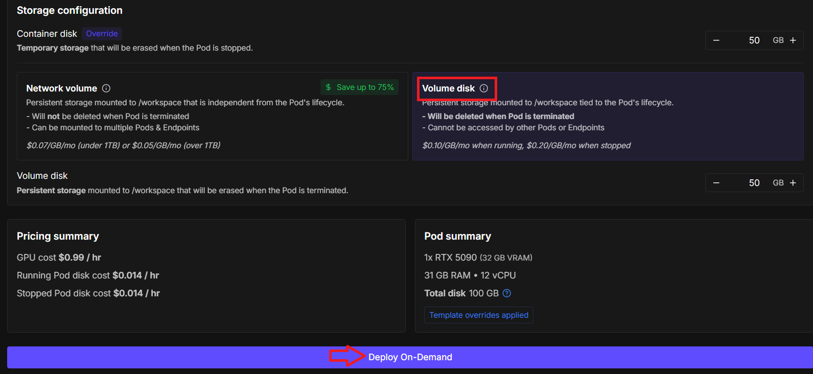

---
### 단계2: Llama Factory WebUI 접속
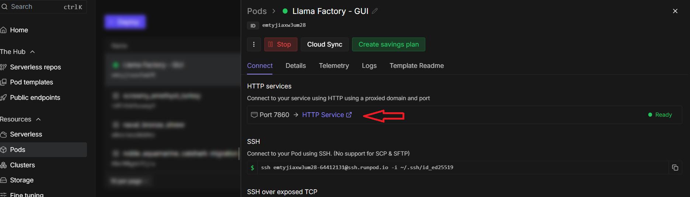

---
### 단계3: training_args.yaml 적용
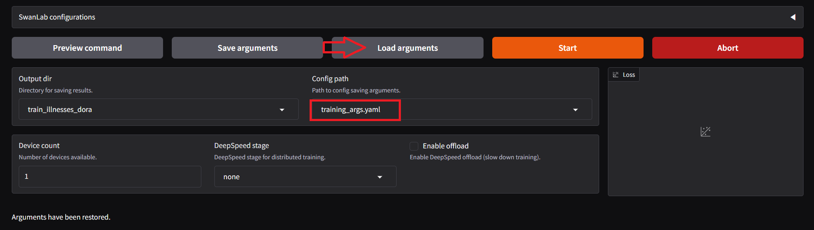

---
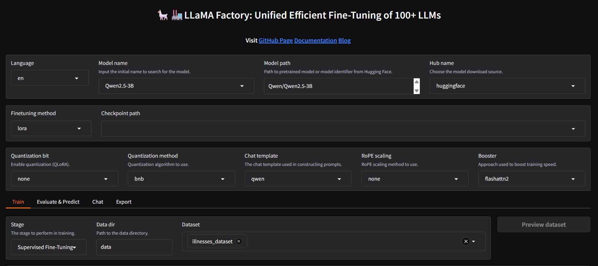

---
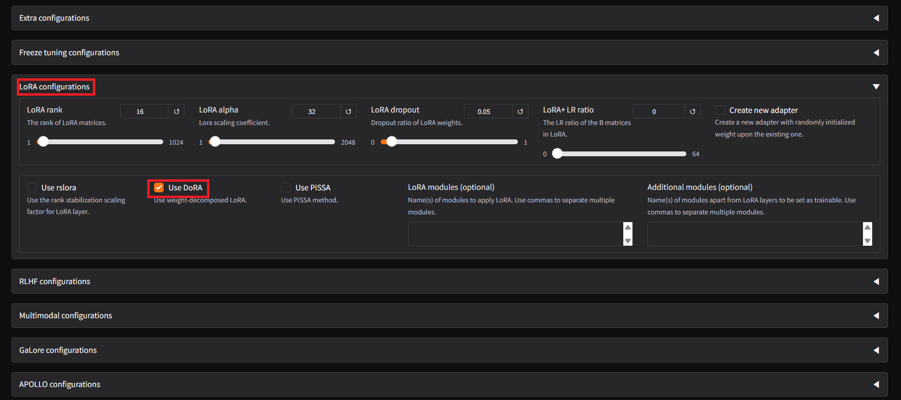

---
### 단계4: 훈련 시작

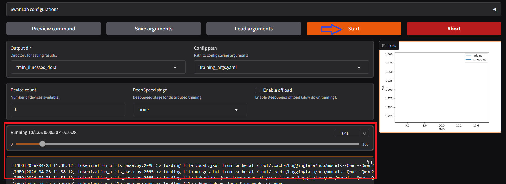

---
> 학습 완료 

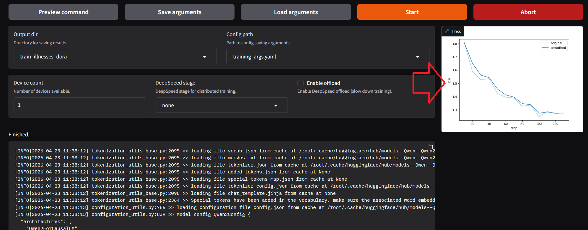

---
### 단계5: HuggingFace 업로드
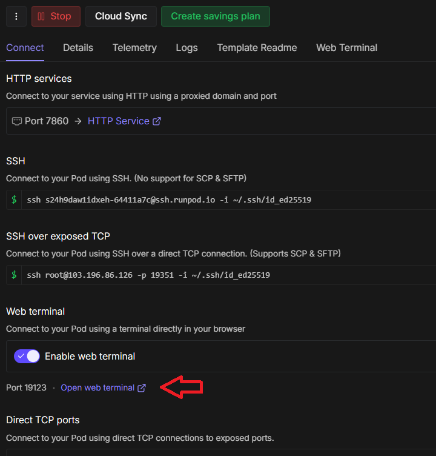

---
> Upload model to HuggingFace Hub
```shell
bash /app/upload_model.sh
```
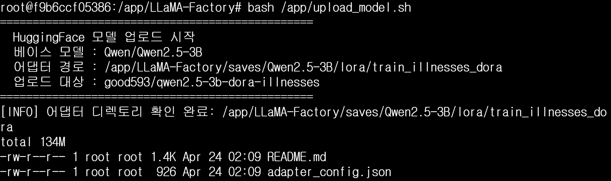

---
> [HuggingFace Hub](https://huggingface.co/good593/qwen2.5-3b-dora-illnesses)에서 업로드된 모델 확인 

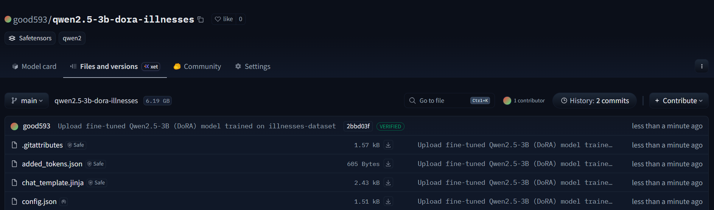

