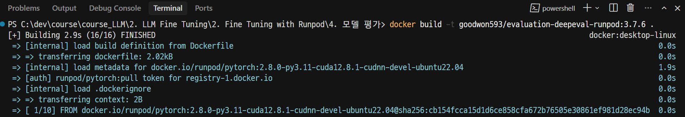
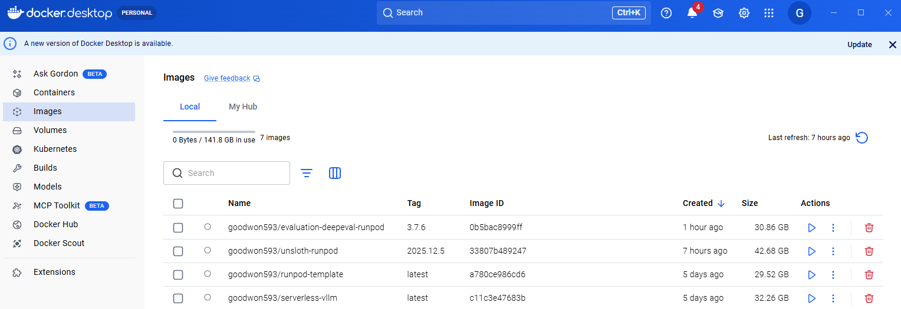
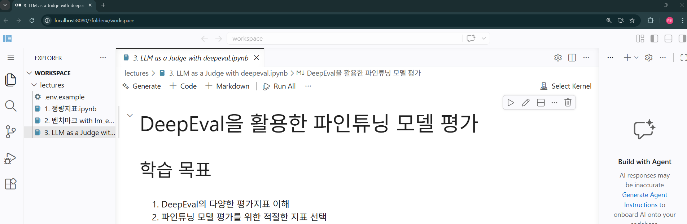
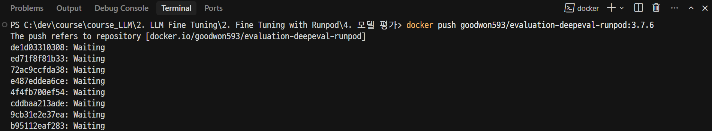
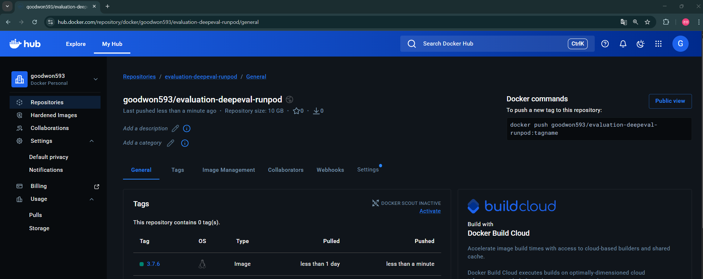
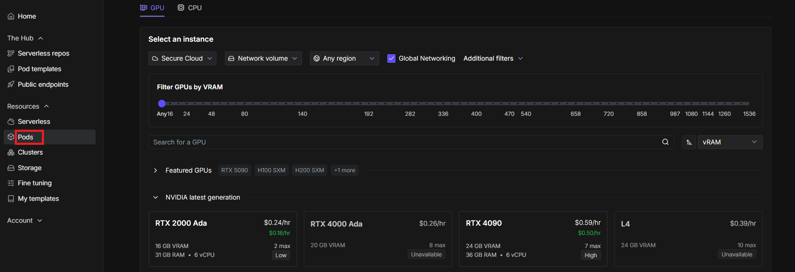
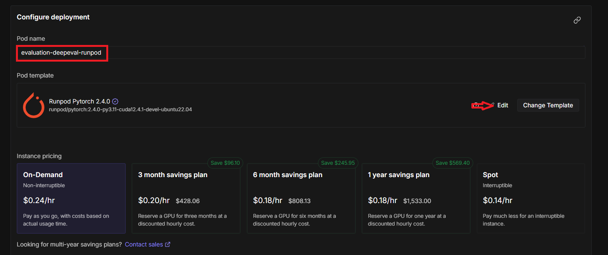
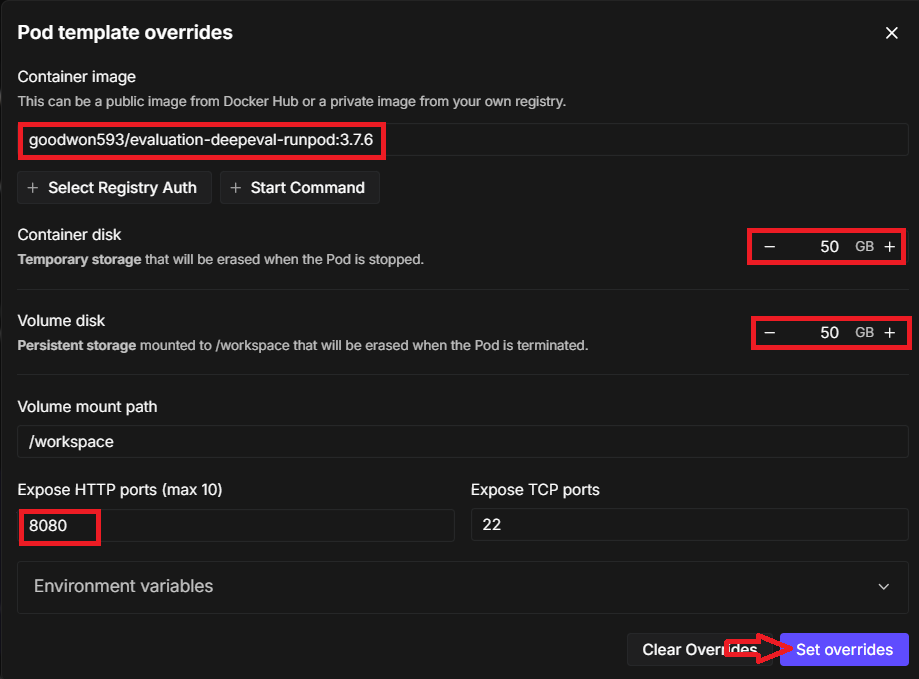
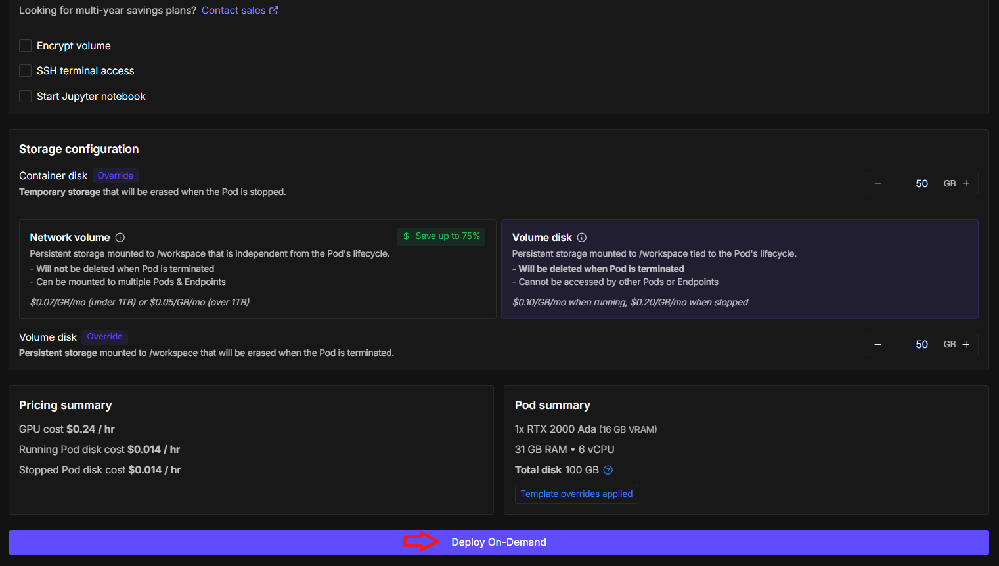

# Docker 

---
### 단계1: Docker Image 생성
```shell
docker build -t <Docker ID>/evaluation-deepeval-runpod:3.7.6 .
```


---
> 결과확인



---
### 단계2: Docker Container 실행 
```shell
# CPU용
docker run -it --rm -p 8080:8080 -v ./workspace:/workspace <Docker ID>/evaluation-deepeval-runpod:3.7.6
```


---
> [결과확인](http://localhost:8080/?folder=/workspace)



---
### 단계3: Docker Hub 배포 
```shell
docker push <Docker ID>/evaluation-deepeval-runpod:3.7.6
```


---
> 결과확인



---
# Runpod

---


---


---


---


---


---


