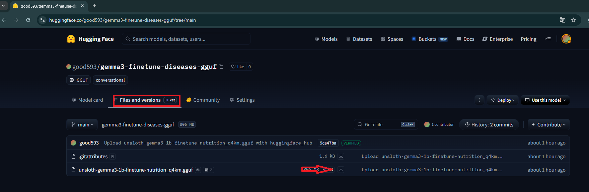
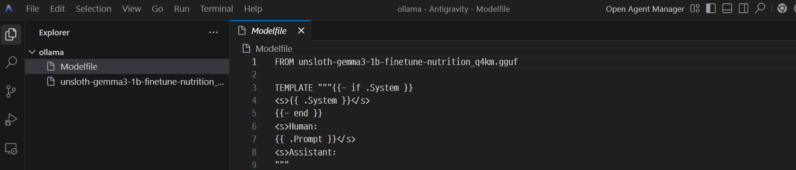
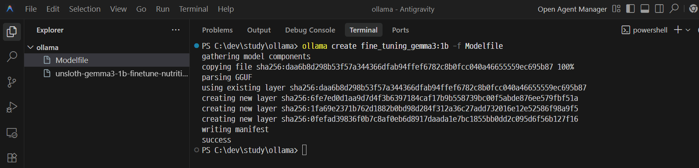
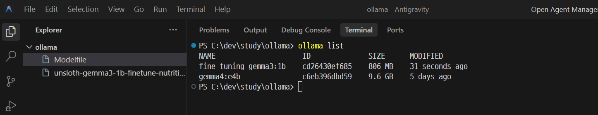
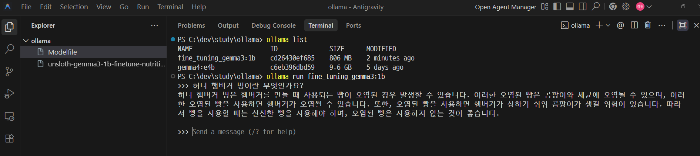

## [단계1: Download GGUF](https://huggingface.co/good593/gemma3-finetune-diseases-gguf)


---
## 단계2: Modelfile 생성 
- 다운로드된 GGUF 파일 설정

```modelfile
FROM unsloth-gemma3-1b-finetune-nutrition_q4km.gguf
```


---
- 프롬프트 템플릿 (TEMPLATE)
  - AI 모델이 대화 맥락을 이해할 수 있도록 구조를 정의합니다.
  - `{{ if .System }}`: 시스템 메시지가 있을 경우 해당 섹션을 포함합니다.
  - `<s>, </s>`: 문장의 시작과 끝을 알리는 특수 토큰입니다.
  - `<s>Human: {{ .Prompt }}</s>`: 사용자의 입력 형식을 정의합니다.
  - `<s>Assistant:`: 모델이 답변을 생성하기 시작할 위치를 지정합니다.

```modelfile
TEMPLATE """{{- if .System }}
<s>{{ .System }}</s>
{{- end }}
<s>Human:
{{ .Prompt }}</s>
<s>Assistant:
"""
```

---
- 시스템 메시지 (SYSTEM)
  - 모델의 페르소나를 설정합니다. "도움이 되고 상세하며 예의 바른 인공지능 비서"라는 기본 역할을 부여하고 있습니다.

```modelfile
SYSTEM """
A chat between a curious user and an artificial intelligence assistant. 
The assistant gives helpful, detailed, and polite answers to the user's questions.
"""
```

---
- 실행 파라미터 (PARAMETER)
  - 모델의 동작 방식을 제어하는 세부 설정입니다.

```modelfile
# 답변의 무작위성을 제거하여 항상 가장 확률이 높은 답변을 하도록 설정합니다.
PARAMETER temperature 0 
# 모델이 한 번에 생성할 수 있는 최대 토큰 수를 3000개로 제한합니다.
PARAMETER num_predict 3000 
# 모델이 기억할 수 있는 이전 대화 내용(컨텍스트 창)의 길이를 4096 토큰으로 설정합니다.
PARAMETER num_ctx 4096 
# 모델이 답변을 생성하다가 이 토큰들을 만나면 생성을 중단하도록 설정하여, 불필요한 텍스트가 뒤에 붙는 것을 방지합니다.
PARAMETER stop <s> 
PARAMETER stop </s>
```

---
## 단계3: Ollama Model 생성
```shell
# ollama create [올라마 모델명]:[테그] -f Modelfile
ollama create fine_tuning_gemma3:1b -f Modelfile 
```


---
> 결과 확인 
```shell
ollama list
```



---
> ollam model test
```shell
ollama run fine_tuning_gemma3:1b
```




