# Docker Hub에 이미지 배포하기

---
### 단계1: Docker Server 실행 및 로그인
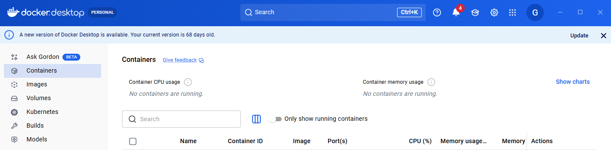

---
### 단계2: Docker Image 생성
```bash
# 도커파일이 있는 폴더에서 실행 
docker build --platform linux/amd64 -t [YOUR_USERNAME]/runpod-ollama:latest .
```
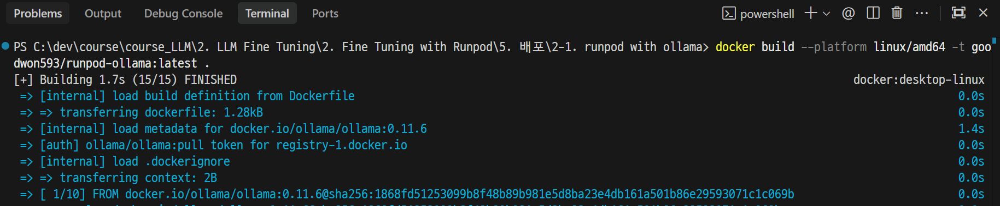

---
> 결과 확인 

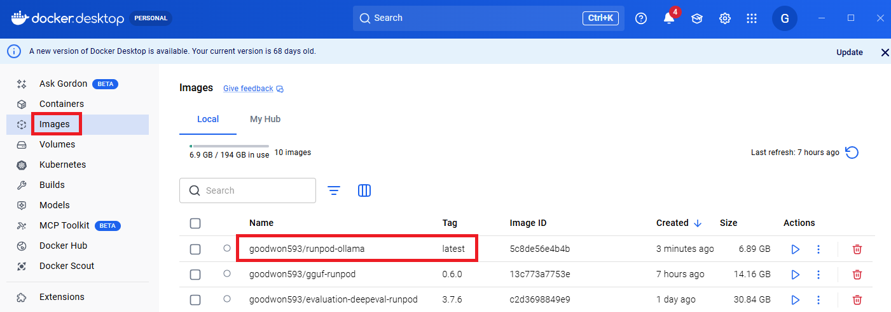

---
### 단계3: Docker Hub 배포 
```shell
docker push [YOUR_USERNAME]/runpod-ollama:latest
```
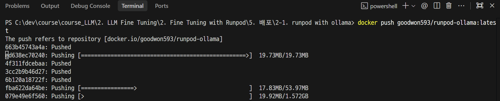

---
> [결과 확인](https://hub.docker.com/repository/docker/goodwon593/runpod-ollama/general)

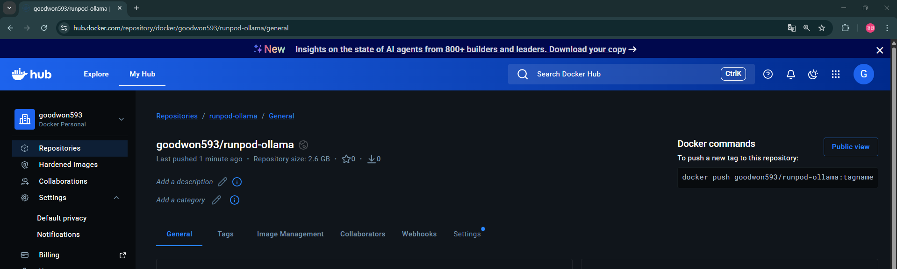

---
# [Runpod 배포](https://console.runpod.io/serverless)

---
### 단계1: Runpod > Serverless
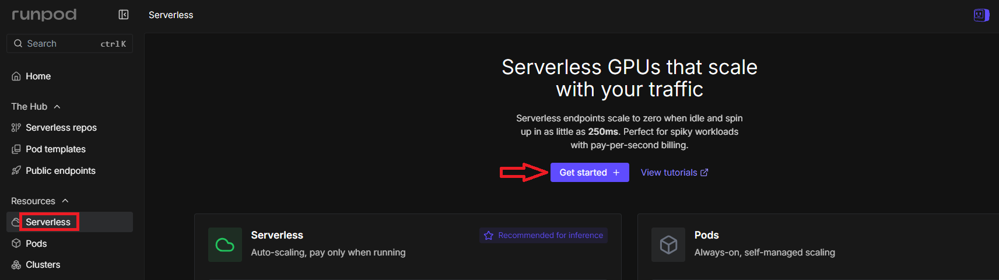

---
### 단계2: Create a new deployment
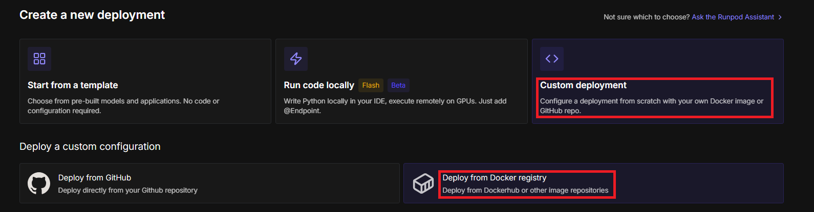

---
> Container image

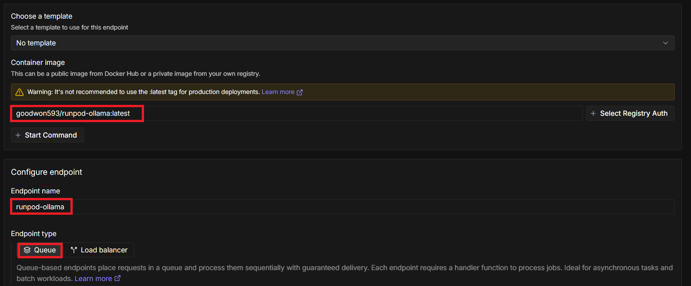

---
> Worker type

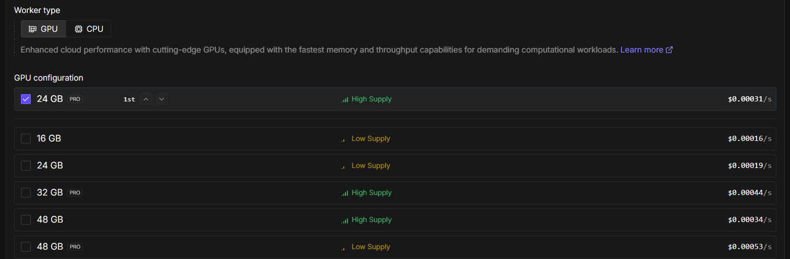

---
> Create endpoint

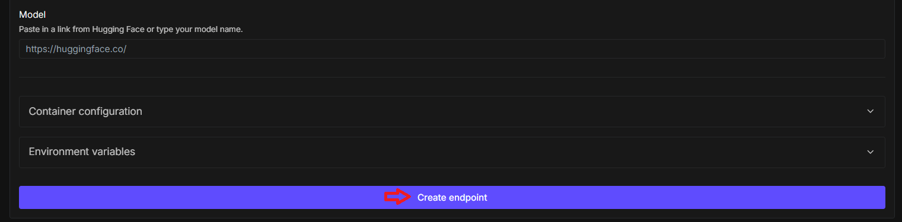

---
### 단계3: Serverless 테스트
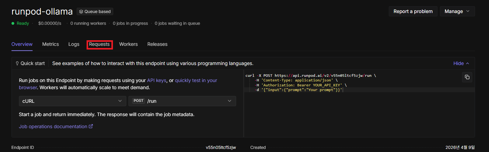

---
> 허니 햄버거 병이란 무엇인가요?

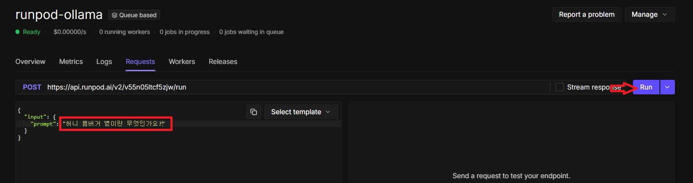

---
> 결과 확인 

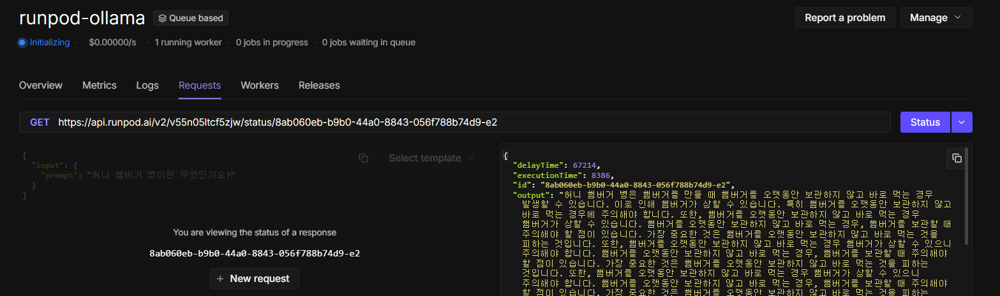
