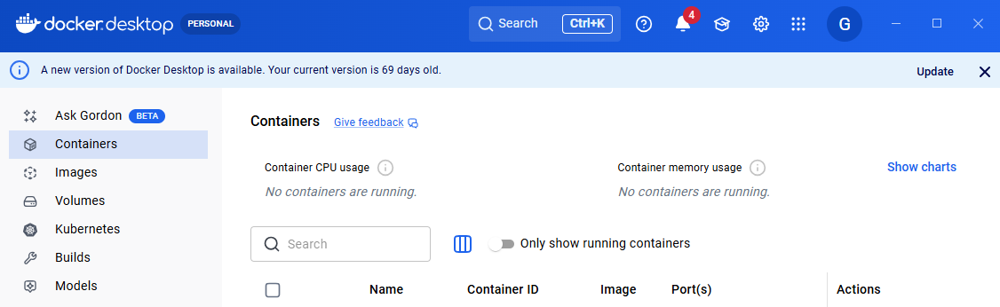
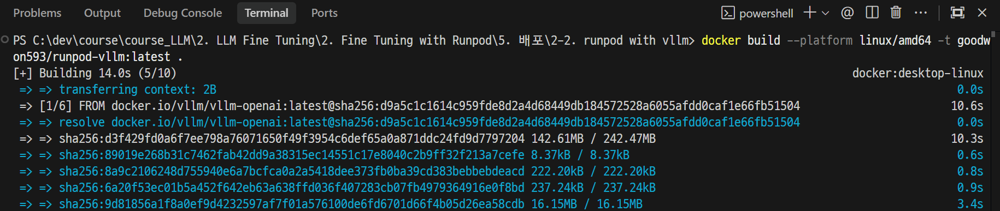
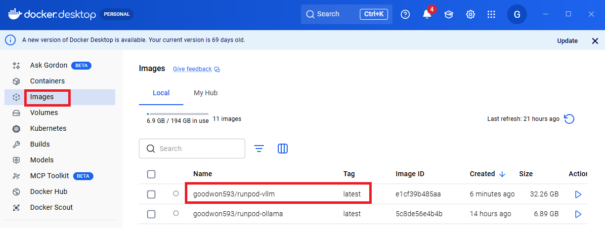
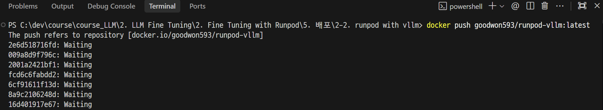
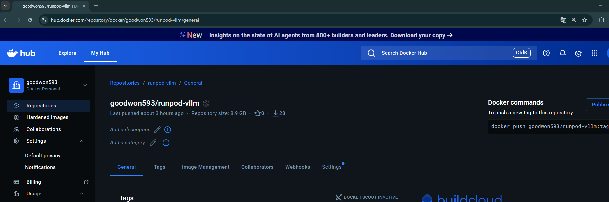

# Docker

---
### 단계1: Docker Server 실행 및 로그인 


---
### 단계2: Docker Image 생성
```bash
# 도커파일이 있는 폴더에서 실행 
docker build --platform linux/amd64 -t [YOUR_USERNAME]/runpod-vllm:latest .
```


---


---
### 단계3: Docker Hub 배포 
```shell
docker push [YOUR_USERNAME]/runpod-vllm:latest
```


---


---
# Runpod  

---
### 단계 1: 템플릿 생성


