# Docker

---
### 단계1: Docker Server 실행 및 로그인 


---
### 단계2: Docker Image 생성
```bash
# 도커파일이 있는 폴더에서 실행 
docker build --platform linux/amd64 -t [YOUR_USERNAME]/runpod-vllm:latest .
```


---


---
### 단계3: Docker Hub 배포 
```shell
docker push [YOUR_USERNAME]/runpod-vllm:latest
```


---


---
# Runpod  

---
### [단계 1: Template 생성](https://console.runpod.io/user/templates)
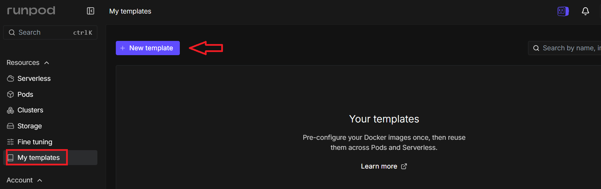

---
> Name, Public template 등 

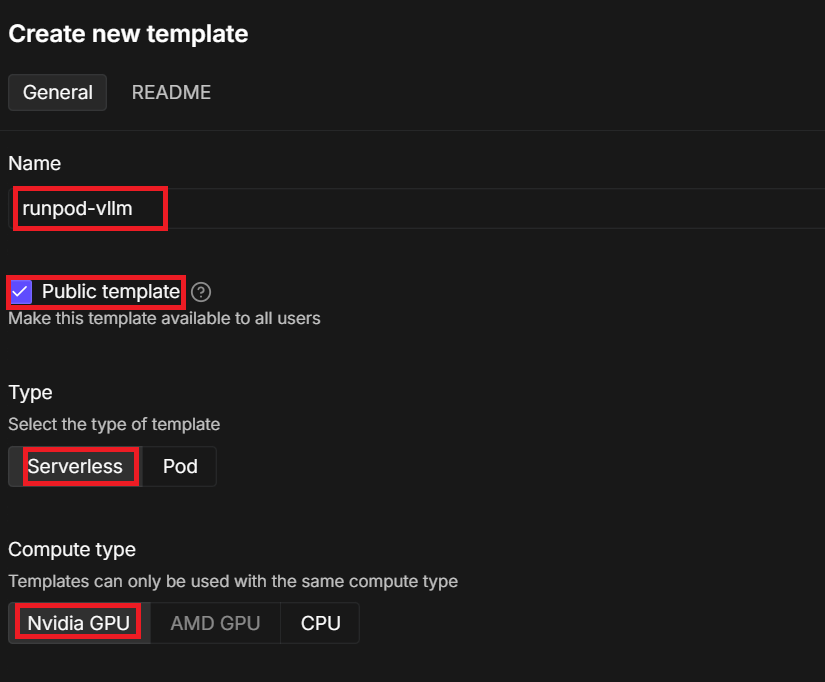

---
> Container image 등 

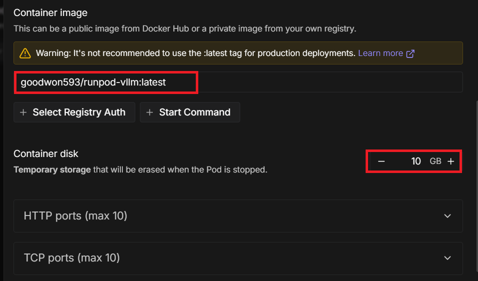

---
> (옵션) 환경변수 등록 

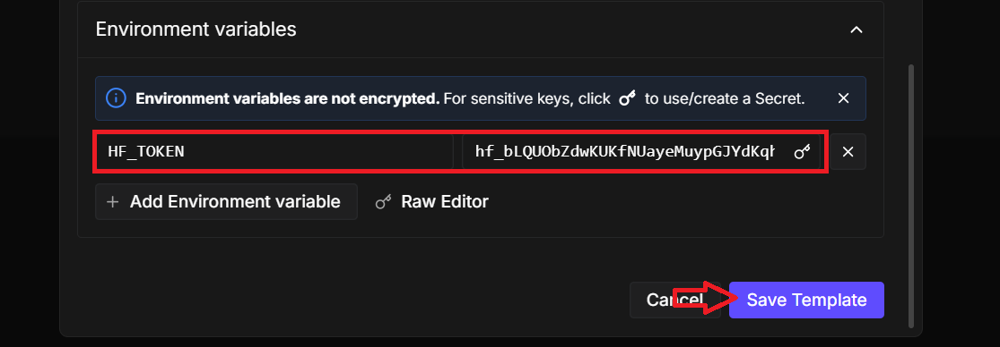

---
> 결과 확인 

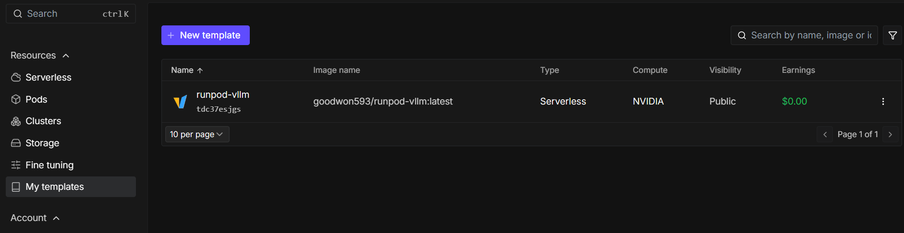

---
### [단계 2: Serverless 생성](https://console.runpod.io/serverless)
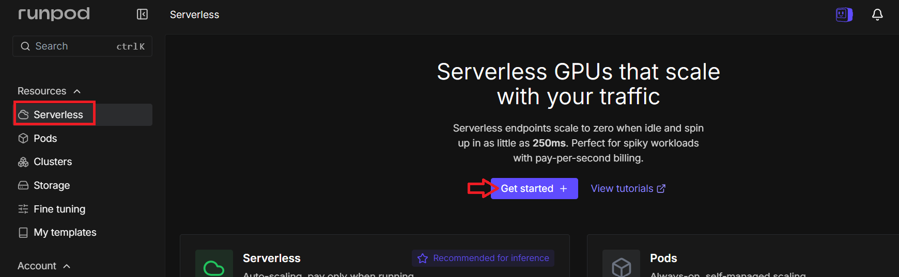

---
> Choose a template

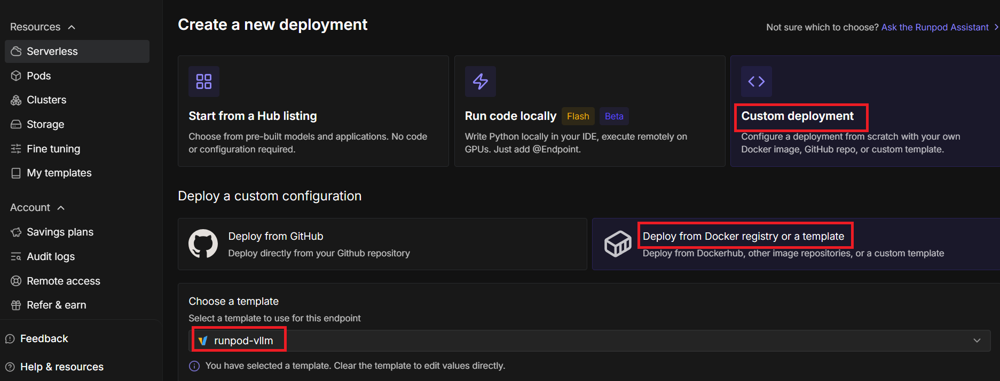

---
> Configure endpoint

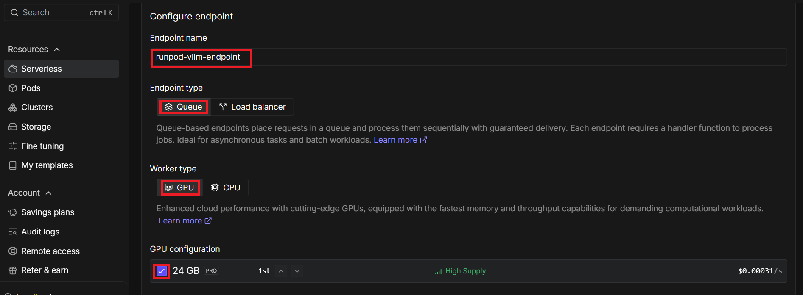

---
> Create endpoint

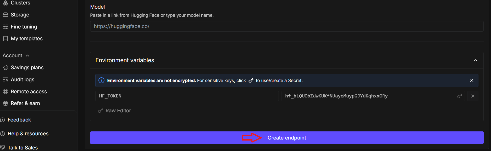

---
### [단계 3: Active Workers 적용](https://console.runpod.io/serverless)
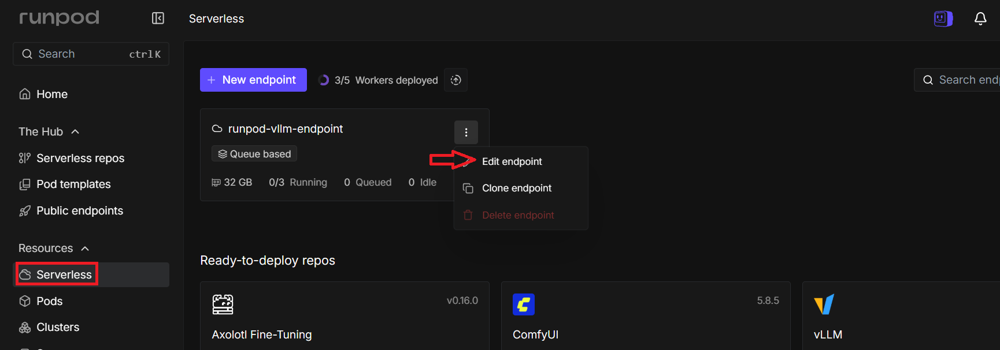

---
> Active Workers

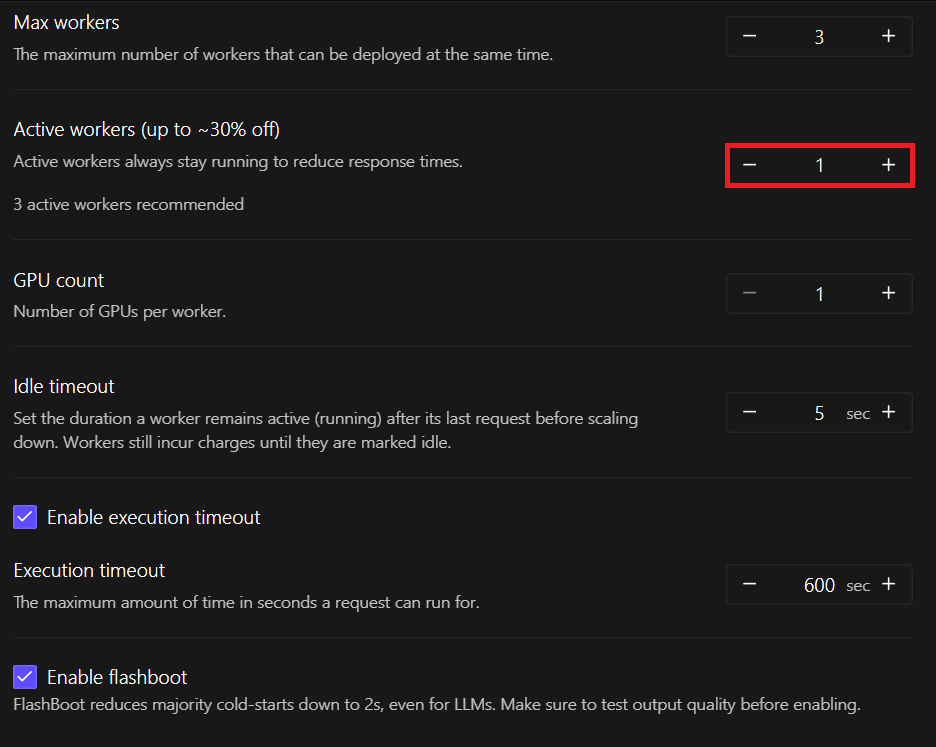

---
> Save Endpoint

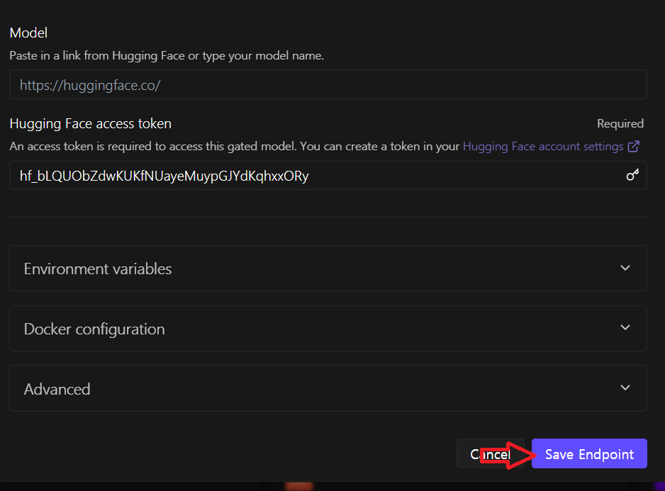

---
> 적용 확인 

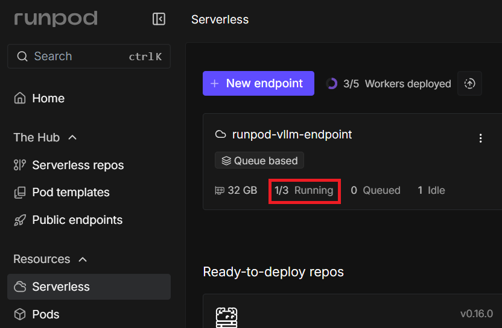

---
### 단계 4: 테스트 
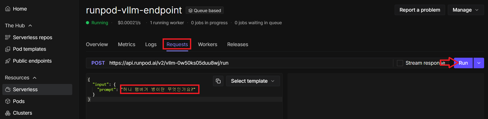

---


