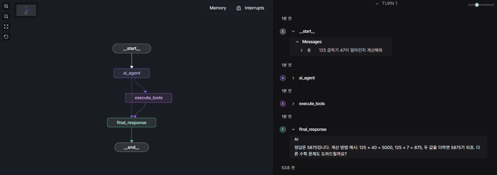

# LangGraph Studio 프로젝트

이 프로젝트는 LangGraph를 사용하여 간단한 워크플로우 그래프를 구현하고 LangGraph Studio에서 시각화하는 예제입니다.

---
## 프로젝트 구조

```
langgraph studio/
├── src/
│   ├── __init__.py
│   ├── graph.py      # 메인 그래프 정의
│   ├── models.py      # 모델 함수들
│   ├── nodes.py      # 노드 함수들
│   ├── states.py      # 상태 클래스
│   └── tools.py     # 도구 함수들
├── langgraph.json    # LangGraph Studio 설정
├── pyproject.toml    # 프로젝트 설정
├── requirements.txt  # 의존성 목록
└── README.md        # 이 파일
```

---
### 그래프 흐름

```css
                    시작
                     |
                     v
                    ai_agent
                     |
                     v
         +-----------+-----------+
         |                       |
         v                       |
  execute_tools                  |
         |                       |
         +-----+-----+-----------+
                     |
                     v
                    final_response
                     |
                     v
                    종료
```

---
## 설치 및 실행

---
### 1. 환경 변수 설정
- `.env.example` 파일을 참고하여 `.env` 파일을 설정하세요. 
- `.env.example` 파일에는 프로젝트에 필요한 환경 변수들이 정의되어 있습니다.

`.env` 파일 예시:
```env
# LangSmith 설정 (필수)
LANGCHAIN_API_KEY="LangSmith API 키"
LANGCHAIN_PROJECT="프로젝트 이름"

```

---
### 2. 의존성 설치

```bash
# 가상환경 활성화 (권장)
uv venv .venv
source .venv/bin/activate  # Linux/Mac
# 또는
.venv\Scripts\activate     # Windows

# 프로젝트 설치
uv pip install -r requirements.txt
uv pip install -e .
```

---
### 3. LangGraph Studio 실행

```bash
langgraph dev
```

실행 후 다음 URL에서 접근할 수 있습니다:
- **Studio UI**: https://smith.langchain.com/studio/?baseUrl=http://127.0.0.1:2024
- **API**: http://127.0.0.1:2024
- **API Docs**: http://127.0.0.1:2024/docs

---
**LangSmith 연동**:
- LangGraph Studio는 자동으로 LangSmith와 연동됩니다
- https://smith.langchain.com 에서 프로젝트 대시보드를 확인할 수 있습니다



---
## 사용 예시

LangGraph Studio에서 다음과 같이 테스트할 수 있습니다:

1. Studio UI에 접속
2. 그래프 시각화 확인
3. 테스트 입력 제공
  - 125 곱하기 47이 얼마인지 계산해줘
  - 서울의 날씨가 어떤지 알려줘
  - 3시간 후에 회의 준비하라고 알림 설정해줘
4. 실행 결과 확인

---
**LangSmith 대시보드에서 확인**:
1. https://smith.langchain.com 에서 프로젝트 선택
2. 그래프 실행 히스토리 및 성능 메트릭 확인
3. 각 노드별 실행 시간 및 결과 분석
4. 에러 로그 및 디버깅 정보 확인

---
## 참고문서
- https://langchain-ai.github.io/langgraph/tutorials/langgraph-platform/local-server/ 
- https://github.com/langchain-ai/new-langgraph-project/tree/main
