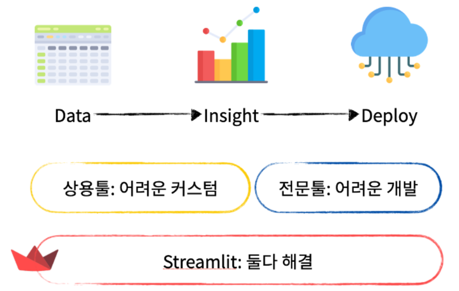
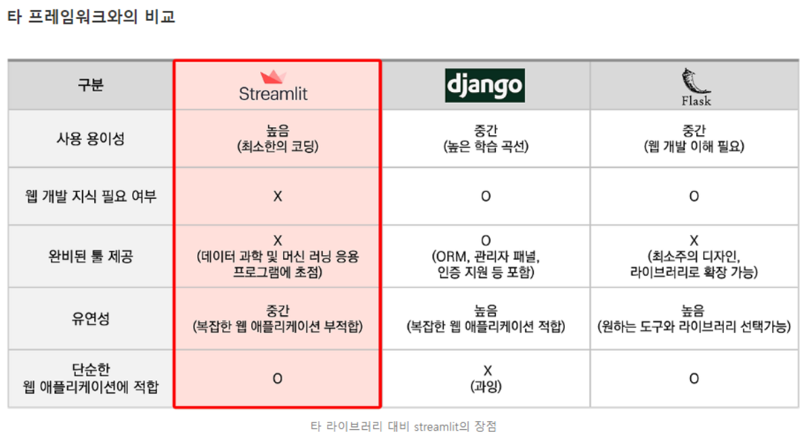

# [Streamlit이란?](https://yozm.wishket.com/magazine/detail/1827/)
> Streamlit은 데이터 사이언티스트, 엔지니어, 그리고 분석가들이 Python으로 데이터 앱을 빠르고 쉽게 만들 수 있도록 돕는 오픈 소스 앱 프레임워크이다.

---


---
### [Streamlit 장점](https://wscode.tistory.com/126)
- `간편성`: 복잡한 프론트엔드 지식이 없어도 웹 앱을 만들 수 있습니다.
- `반응형`: 자동으로 업데이트되는 위젯을 제공하여 데이터와 시각화의 상호작용을 쉽게 구현할 수 있습니다.
- `데이터 통합`: 주요 데이터 분석 및 시각화 라이브러리 (예: Pandas, Matplotlib, Plotly)와의 통합이 용이합니다.

### Streamlit 단점
- 사용용도에 따라서 단순한 웹 애플리케이션을 생성하는 경우 streamlit이 합리적이며, 대규모 배포의 경우에는 다른 프레임워크가 적합할 수 있으므로 용도에 따라서 선택하여 활용이 필요합니다.

---


---
# [Streamlit 사용법](https://docs.streamlit.io/)

## [Streamlit 설치](https://docs.streamlit.io/get-started/installation)
```shell
pip install streamlit
```

---
## [Streamlit Tutorials](https://docs.streamlit.io/develop/tutorials)

- [Google 인증 예제](https://docs.streamlit.io/develop/tutorials/authentication/google)
- [langchain을 이용한 챗봇 예제](https://docs.streamlit.io/develop/tutorials/chat-and-llm-apps/llm-quickstart)
- [Database 연결 예제](https://docs.streamlit.io/develop/tutorials/databases)
- [Multi Page 예제](https://docs.streamlit.io/develop/tutorials/multipage/dynamic-navigation)


