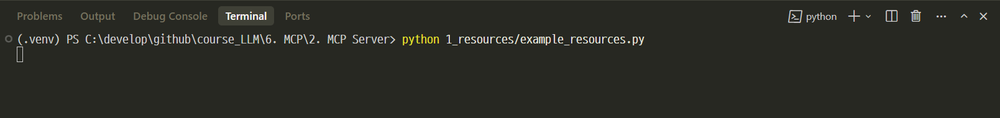
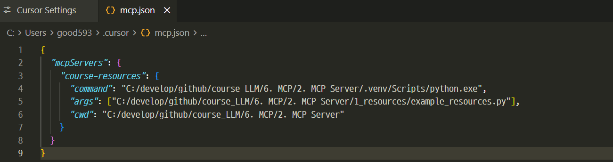
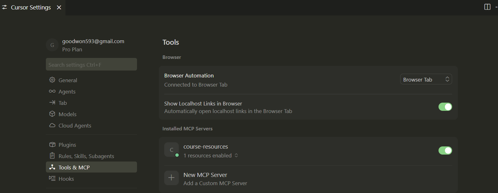
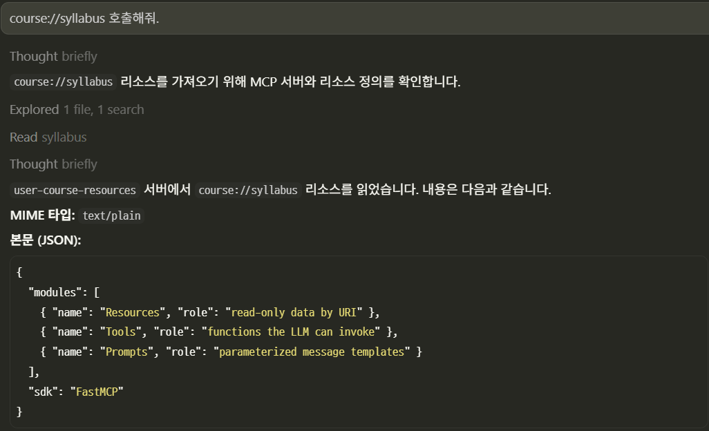
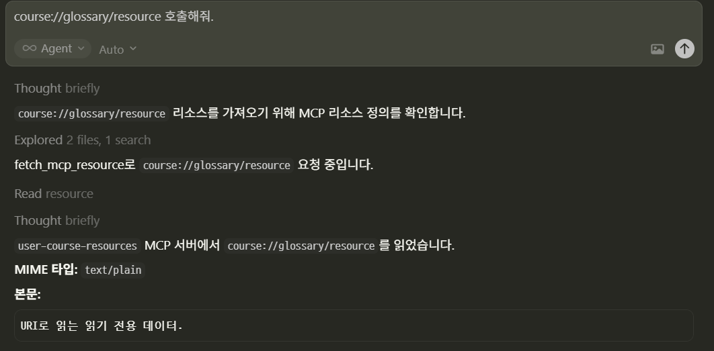

# Resources — 읽기 전용 데이터 엔드포인트

---
## 개념

**Resource**는 서버가 “여기 URI를 열면 이 내용이 나온다”고 **선언하는 읽기 전용 자원**입니다.

- 파일 내용, 설정 JSON, DB에서 읽은 스냅샷, 생성형이지만 **조회 목적**인 텍스트 등에 적합합니다.
- “사용자가 승인한 뒤 실행되는 **액션**”은 보통 **Tool** 쪽이 더 자연스럽습니다(역할이 겹치지 않게 설계).

---
## 프로토콜 관점(요약)

클라이언트는 대략 다음 순서로 상호작용합니다.

1. **목록**: 어떤 리소스(및 템플릿)가 있는지 조회
2. **읽기**: 특정 URI에 대해 내용 요청 → 서버가 등록된 핸들러를 실행해 내용 반환

> FastMCP는 이 과정을 데코레이터와 반환 타입 변환으로 추상화합니다.

---
## FastMCP 사용 요령

---
### 1) URI 지정

`@mcp.resource("scheme://path/...")` 의 첫 인자가 클라이언트가 사용하는 **고유 URI**입니다. 팀 규칙에 맞는 네이밍(예: `course://notes/intro`)을 정해 두면 유지보수에 유리합니다.

### 2) 지연 실행

함수 본문은 **해당 URI를 읽을 때** 실행됩니다. 매 요청마다 최신 값이 필요하면 DB/API 조회를 여기 두면 됩니다.

---
### 3) 반환 타입(대표)

| 반환 | 동작(개념) |
|------|------------|
| `str` | 텍스트 리소스로 전달 |
| `dict` / `list` | JSON 직렬화되어 텍스트로 전달되는 경우가 일반적 |
| `bytes` | 바이너리(이미지 등). `mime_type`을 명시하는 것이 안전 |

### 4) Resource Template (동적 URI)

URI에 `{변수}`를 넣어 **경로 파라미터**를 받는 템플릿 리소스를 만들 수 있습니다. 예: `course://student/{id}/summary` → 함수 인자 `id`.

---
## 예제 코드

이 폴더의 예제: [`example_resources.py`](example_resources.py)

---
## 실행 방법

- **작업 디렉터리**는 강의 프로젝트 루트(`2. MCP Server 개발` 폴더)로 둡니다.
  ```bash
  pip install -r requirements.txt
  ```

가상환경(`.venv`)을 쓰는 경우, 활성화한 뒤 아래를 실행하거나 `python` 대신 `.venv\Scripts\python.exe` 절대 경로를 쓰면 됩니다.

- **Python으로 직접 실행**
  ```bash
  python 1_resources/example_resources.py
  ```


---
## 터미널에서 “아무 반응 없음”은 정상

서버는 **stdio(표준 입출력)** 로 MCP 메시지를 주고받습니다. 터미널만 켜 두면 **대기 상태**로 보이고, 리소스 목록·읽기는 **MCP 클라이언트**(예: Cursor)가 이 프로세스에 붙을 때 이루어집니다.



---
## Cursor에서 붙여 테스트하기

```json
"course-resources": {
  "command": "C:/develop/github/course_LLM/6. MCP/2. MCP Server/.venv/Scripts/python.exe",
  "args": ["C:/develop/github/course_LLM/6. MCP/2. MCP Server/1_resources/example_resources.py"],
  "cwd": "C:/develop/github/course_LLM/6. MCP/2. MCP Server"
}
```


---


---
### 테스트 > course://syllabus 호출해줘.



---
### 테스트 > course://glossary/resource 호출해줘.


