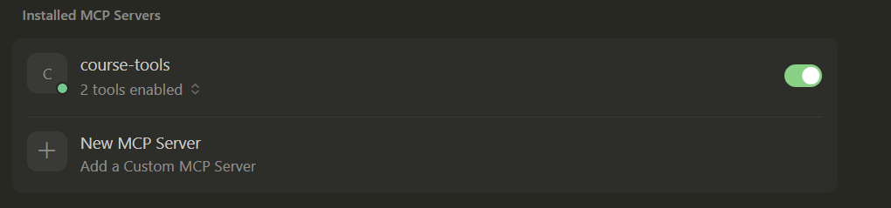
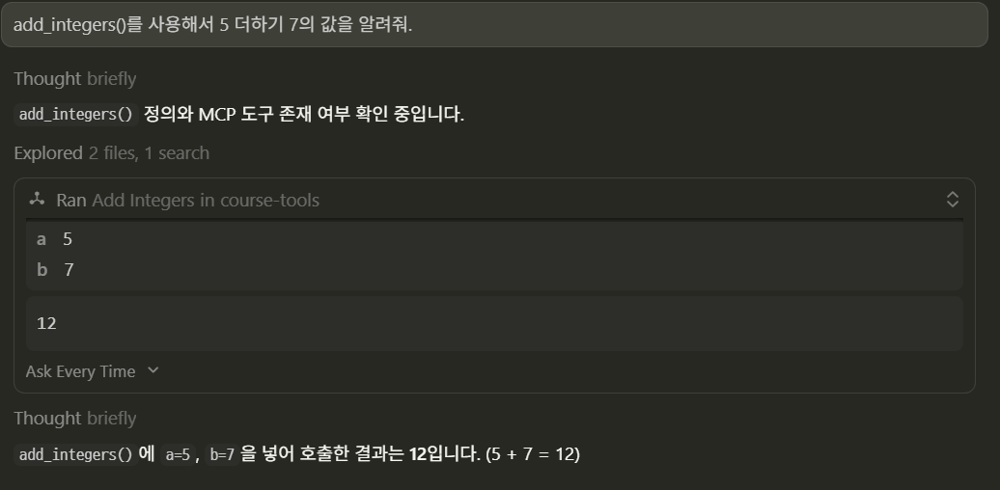
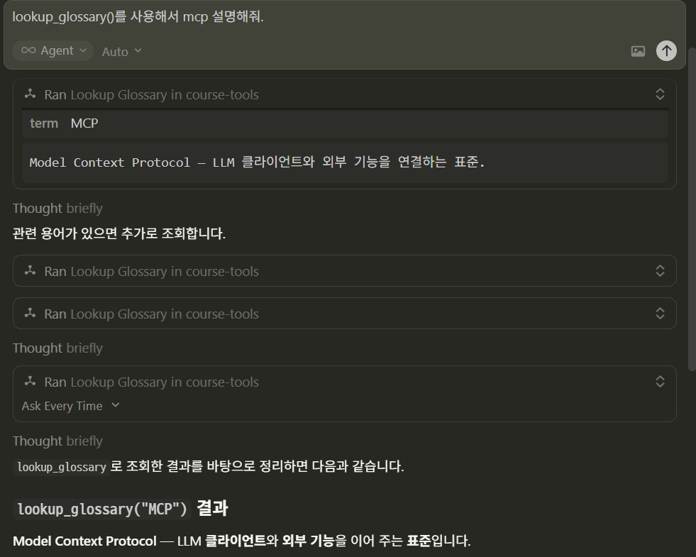

# Tools — LLM이 호출할 수 있는 함수

---
## 개념

**Tool**은 클라이언트(보통 LLM 에이전트 루프)가 `tools/call`로 **이름과 인자**를 넘기면, 서버가 Python 함수를 실행하고 **결과를 구조화**해 돌려주는 기능입니다.

- 계산, API 호출, 파일 쓰기, 티켓 생성 등 **실행·변경**이 수반되는 작업에 적합합니다.
- “그냥 문서 내용을 보여 주면 되는가?”라면 **Resource**가 더 단순할 수 있습니다.

---
## 프로토콜 관점(요약)

1. 서버가 도구 목록과 **JSON Schema 형태의 입력 정의**를 노출
2. 클라이언트가 도구 이름 + 인자로 호출
3. 서버가 결과(텍스트·구조화 데이터 등)를 반환

> FastMCP는 함수 시그니처에서 스키마를 생성하므로, **인자 이름·타입·기본값**이 곧 API 계약이 됩니다.

---
## FastMCP 사용 요령

---
### 1) `@mcp.tool()`

FastMCP 최신 버전에서는 데코레이터를 **호출 형태**로 씁니다 (`@tool()`).

```python
@mcp.tool()
def add(a: int, b: int) -> int:
    ...
```

- 함수 이름 → 도구 이름(기본)
- docstring → 설명(기본)
- 매개변수 → 필수/선택, 타입 힌트 반영

---
### 2) async

네트워크·DB 등 I/O가 있으면 `async def`를 사용합니다.

### 3) Context (선택)

로깅, 진행 알림, 클라이언트 기능 연동 등은 `Context`를 주입해 처리할 수 있습니다. ([Context 문서](https://gofastmcp.com/v2/servers/context))

---
## Cursor에서 붙여 테스트하기

```json
"course-tools": {
  "command": "C:/develop/github/course_LLM/6. MCP/2. MCP Server/.venv/Scripts/python.exe",
  "args": ["C:/develop/github/course_LLM/6. MCP/2. MCP Server/2_tools/example_tools.py"],
  "cwd": "C:/develop/github/course_LLM/6. MCP/2. MCP Server"
}
```


---
### 테스트 > add_integers()를 사용해서 5 더하기 7의 값을 알려줘.



---
### 테스트 > lookup_glossary()를 사용해서 mcp 설명해줘.


