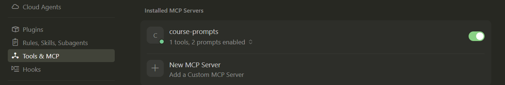
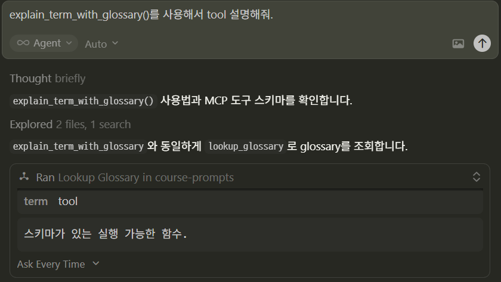

# Prompts — 재사용 가능한 프롬프트 템플릿

---
## 개념

**Prompt**는 앱·팀에서 자주 쓰는 질문/지시문을 **이름과 매개변수**로 표준화해 두는 기능입니다.

- 온보딩 질문, 코드 리뷰 요청, 데이터 분석 지시 등 **반복 시나리오**에 적합합니다.
- “모델이 실행하는 함수”는 **Tool**, “읽을 데이터”는 **Resource**와 역할이 다릅니다.

---
## 프로토콜 관점(요약)

1. 서버가 프롬프트 목록(이름, 설명, 인자 스키마)을 노출
2. 클라이언트가 이름과 인자로 렌더링 요청
3. 서버가 **한 개 또는 여러 개의 메시지**(역할+내용)를 반환

---
## FastMCP 사용 요령

---
### 1) 가장 단순한 형태: `str` 반환

함수가 문자열을 반환하면, FastMCP가 이를 **사용자 메시지** 등으로 매핑합니다(버전에 따라 세부 타입이 다를 수 있으나 입문에서는 `str`로 시작해도 충분합니다).

```python
@mcp.prompt
def ask_about_topic(topic: str) -> str:
    """주제 설명을 요청하는 사용자 메시지."""
    return f"'{topic}'에 대해 초보자도 이해할 수 있게 설명해 줘."
```

---
### 2) 매개변수 = 템플릿 슬롯

필수/선택은 Python 기본값 규칙과 동일합니다. 인자가 곧 **프롬프트 인자 스키마**가 됩니다.

### 3) MCP 인자는 문자열 기반

스펙상 클라이언트는 문자열 인자를 주는 경우가 많고, FastMCP는 `list[int]` 같은 타입에 대해 **JSON 문자열 형식** 안내를 스키마 설명에 붙이기도 합니다. 입문 예제에서는 `str`, `int`, `bool` 정도로 시작하는 것을 권장합니다.

### 4) 고급: `Message`, `PromptMessage` 등

역할(`user`/`assistant`/`system`)을 명시한 **다중 메시지** 시나리오는 FastMCP의 프롬프트 타입을 사용합니다. ([Prompts 문서](https://gofastmcp.com/v2/servers/prompts))

---
## Cursor에서 붙여 테스트하기

```json
"course-prompts": {
  "command": "C:/develop/github/course_LLM/6. MCP/2. MCP Server/.venv/Scripts/python.exe",
  "args": ["C:/develop/github/course_LLM/6. MCP/2. MCP Server/3_prompts/example_prompts.py"],
  "cwd": "C:/develop/github/course_LLM/6. MCP/2. MCP Server"
}
```



---
### 테스트 > explain_term_with_glossary()를 사용해서 tool 설명해줘.


