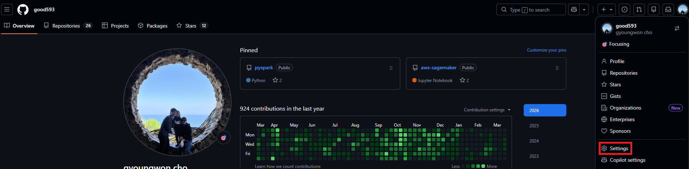
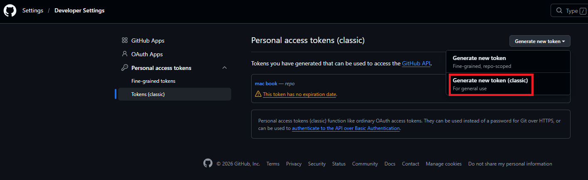
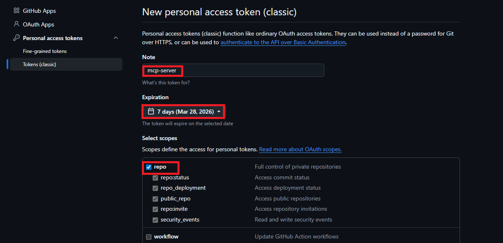
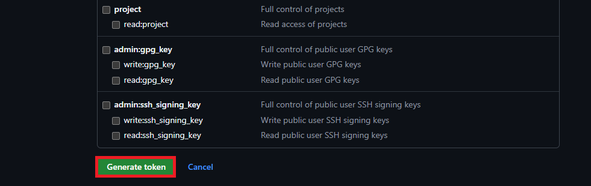
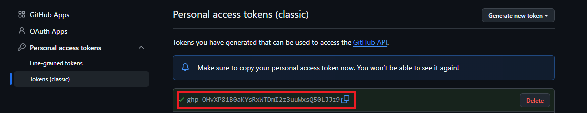
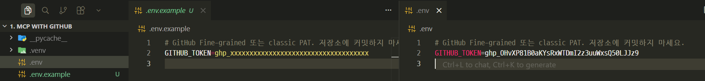
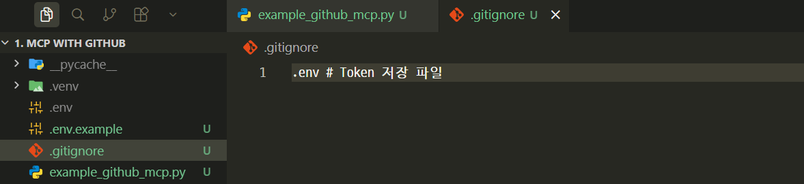
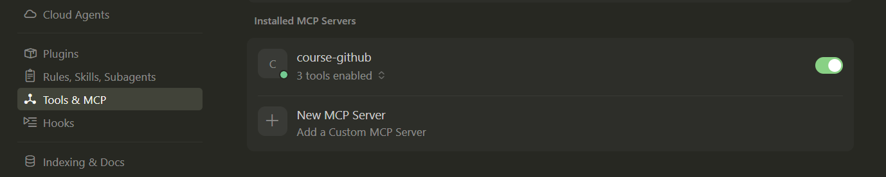
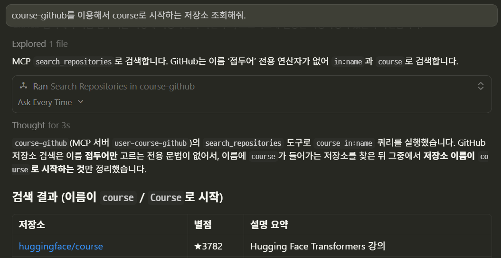
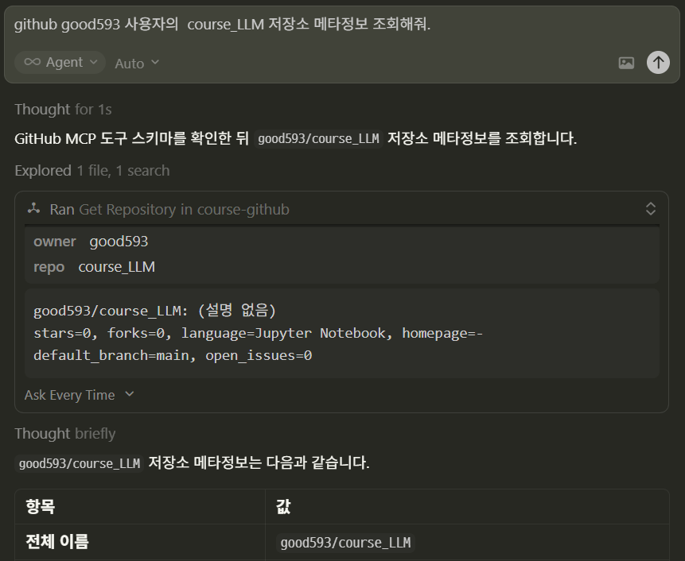

# MCP with Github
> GitHub REST API를 `httpx`로 호출하고 **FastMCP** 도구로 노출하는 과정을 다룹니다.

---
## [Github API]((https://docs.github.com/ko/rest) ) 
> GitHub REST API를 사용하여 통합을 만들고, 데이터를 검색하고, 워크플로를 자동화합니다.

---
## GitHub REST API 핵심

| 항목 | 내용 |
|------|------|
| Base URL | `https://api.github.com` |
| 권장 헤더 | `Accept: application/vnd.github+json`, `X-GitHub-Api-Version: 2022-11-28` |
| 인증(실습) | `Authorization: Bearer <PAT>` |
| 응답 | 대부분 JSON. 오류 시 `message` 필드 등 확인 |

---
### API Token 생성하기 

#### 1) Github Login > Setting



---
#### 2) Setting > Developer Settings > Tokens



---
#### 3) New personal access token (classic)



---
> Token 생성하기 



---
#### 4) .env 파일에 Token 복사하기

> 생성된 Token 복사하기



> .env.example을 이용해서 .env 파일 생성



---
#### 5) .gitignore
> 프로젝트 루트에 `.env` 파일을 두고 **절대 커밋하지 않는다**. 



---
## MCP를 Cursor에 적용하기

```json
"course-github": {
  "command": "C:/develop/github/course_LLM/6. MCP/3. MCP with API/1. MCP with GitHub/.venv/Scripts/python.exe",
  "args": ["C:/develop/github/course_LLM/6. MCP/3. MCP with API/1. MCP with GitHub/example_github_mcp.py"],
  "cwd": "C:/develop/github/course_LLM/6. MCP/3. MCP with API/1. MCP with GitHub"
}
```


---
### 테스트 > course-github를 이용해서 course로 시작하는 저장소 조회해줘.



---
### 테스트 > github good593 사용자의  course_LLM 저장소 메타정보 조회해줘.




