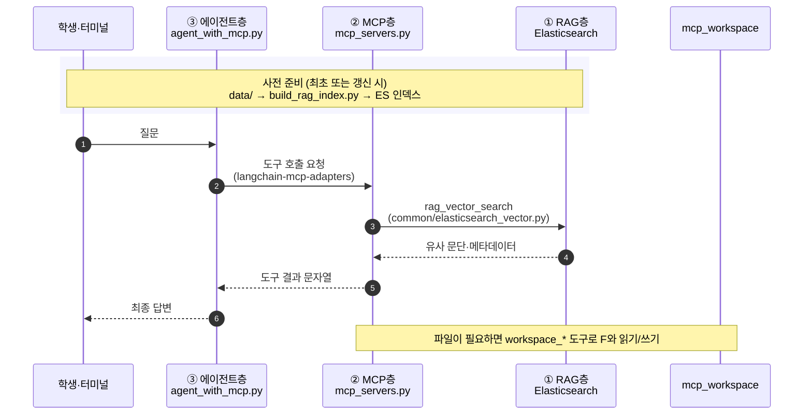

# MCP with LangChain — RAG·워크스페이스·에이전트 예제

강의용 예제입니다. **Elasticsearch 기반 RAG**, **MCP(Model Context Protocol) 도구**, **LangChain 에이전트**가 어떻게 연결되는지 한 흐름으로 실습할 수 있습니다.

---

## 1. 이 프로젝트에서 배우는 것

| 구분 | 설명 |
|------|------|
| **RAG** | `data/` 텍스트를 임베딩해 Elasticsearch에 넣고, 질문과 비슷한 구절을 **벡터 검색**으로 찾습니다. |
| **MCP** | LLM이 직접 DB·파일에 접속하지 않고, **표준화된 “도구 서버”**에 요청합니다. 여기서는 검색·파일 I/O가 MCP 도구로 노출됩니다. |
| **에이전트** | 사용자 말을 이해하고 **어떤 도구를 호출할지** 정한 뒤, 결과를 바탕으로 답을 만듭니다. (`langchain.agents.create_agent`) |

강의 계획에서 말하는 **에이전트(도구 호출) 층**은 `agent_with_mcp.py`에서 `create_agent`로 구현합니다.

---

## 2. 아키텍처(세 층으로 이해하기)

세 층(아래 1·2·3항)은 **역할 구분**이고, 그림은 [Mermaid 시퀀스 다이어그램](https://mermaid.ai/community/templates/3)처럼 **질문 한 번이 처리될 때 누가 누구에게 무엇을 넘기는지**를 시간 순으로 보여 줍니다.



1. **RAG 층**  
   - `data/`: 용어·설명 텍스트 (`rag-keywords.txt`, `web-keywords.txt` 등)  
   - `elasticsearch/`: Docker로 ES·Kibana 실행  
   - `common/elasticsearch_vector.py`: ES에 대한 **유사도 검색** 래퍼  

2. **MCP 층**  
   - `mcp_servers.py`: FastMCP로 만든 **stdio MCP 서버**(RAG·워크스페이스 도구 모음)  
   - RAG 검색 도구 + `mcp_workspace/` 안에서만 동작하는 파일 도구  

3. **에이전트 층**  
   - `agent_with_mcp.py`: MCP 서버를 **자식 프로세스**로 띄우고, 도구 목록을 가져와 에이전트에 연결  

---

## 3. 사용 라이브러리 (`requirements.txt`)

- **langchain**, **langchain-openai**: 채팅 모델·에이전트  
- **langchain-mcp-adapters**: MCP 서버와 연결해 LangChain **Tool**로 변환  
- **elasticsearch**: 인덱스 구축·검색 클라이언트  
- **fastmcp**, **mcp**: MCP 서버 구현·프로토콜  
- **python-dotenv**: `.env` 로드  

---

## 4. 사전 준비

- Python 3.11+ 권장  
- Docker Desktop (Elasticsearch용)  
- OpenAI API 키 (`OPENAI_API_KEY`) — 임베딩·채팅에 사용  

---

## 5. 설치

프로젝트 루트(이 `README.md`가 있는 폴더)에서:

```bash
python -m venv .venv
```

Windows:

```powershell
.\.venv\Scripts\Activate.ps1
pip install -r requirements.txt
```

macOS / Linux:

```bash
source .venv/bin/activate
pip install -r requirements.txt
```

---

## 6. 환경 변수 (`.env`)

프로젝트 루트에 `.env` 파일을 만들고 예시처럼 채웁니다.

```env
OPENAI_API_KEY=sk-...
# 선택: 임베딩 모델 (기본 text-embedding-3-small)
# OPENAI_EMBEDDING_MODEL=text-embedding-3-small

# Elasticsearch (docker-compose 기본값과 맞춤)
ELASTICSEARCH_URL=http://localhost:9200
ELASTIC_USER=elastic
ELASTIC_PASSWORD=changeme123!

# RAG 인덱스 이름 (build 스크립트·MCP 서버가 동일하게 사용)
RAG_INDEX_NAME=course_rag_mcp

# 선택: 워크스페이스 루트를 바꿀 때
# MCP_WORKSPACE_ROOT=C:\path\to\workspace
```

비밀번호·URL은 `elasticsearch/docker-compose.yml`과 일치해야 합니다.

---

## 7. 실행 순서 (중요)

### 7-1. Elasticsearch 기동

```bash
cd elasticsearch
docker-compose up -d
```

헬스 확인 예시:

```bash
curl -u elastic:changeme123! http://localhost:9200/_cluster/health
```

자세한 설명은 `elasticsearch/README.md`를 참고합니다.

### 7-2. RAG 인덱스 구축

프로젝트 루트로 돌아와:

```bash
python build_rag_index.py --recreate
```

- `data/`의 지정 파일을 잘라서 임베딩 후 `RAG_INDEX_NAME` 인덱스에 넣습니다.  
- 처음이거나 매핑을 바꿨을 때는 `--recreate`로 인덱스를 다시 만듭니다.

### 7-3. 에이전트 실행

질문은 **명령줄 인자**로 넘깁니다. 에이전트가 필요하면 **MCP 도구**를 호출합니다.

```bash
python agent_with_mcp.py "임베딩이 뭐야?"
```

인자 없이 실행하면 사용법이 표시됩니다.

---

## 8. MCP 서버만 단독 실행(선택)

에이전트 없이 MCP 프로토콜로 서버만 띄울 때(다른 클라이언트·IDE 연동용):

```bash
python mcp_servers.py
```

HTTP(SSE)로 띄우려면(SQL 예제와 같이):

```bash
python mcp_servers.py --sse
```

포트 등은 환경변수 `MCP_HTTP_HOST`, `MCP_HTTP_PORT`로 조정할 수 있습니다.

---

## 9. 제공 MCP 도구 요약

| 도구 | 역할 |
|------|------|
| `rag_vector_search` | 질의와 유사한 **용어집 청크**를 ES에서 검색 |
| `workspace_list_files` | `mcp_workspace` 아래 목록 보기 |
| `workspace_read_text` | 허용 경로 내 텍스트 파일 읽기 |
| `workspace_write_text` | 허용 경로에 텍스트 쓰기 (`create` / `overwrite`) |

경로는 **워크스페이스 루트 밖으로 나가지 못하도록** 막혀 있습니다.

---

## 10. 디렉터리 가이드

| 경로 | 설명 |
|------|------|
| `data/` | RAG에 넣을 원문 텍스트 |
| `elasticsearch/` | ES·Kibana Docker 설정 |
| `common/` | ES 벡터 검색용 `ElasticsearchVectorStore` |
| `mcp_workspace/` | 학생 메모·실습 파일용(에이전트가 `workspace_*`로만 접근) |
| `build_rag_index.py` | 인덱스 생성 스크립트 |
| `mcp_servers.py` | MCP 서버(RAG + workspace 도구) |
| `agent_with_mcp.py` | MCP + 에이전트 데모 진입점 |

---

## 11. 자주 겪는 문제

1. **`Elasticsearch ping 실패`**  
   Docker가 떠 있는지, `.env`의 URL·계정이 compose 설정과 같은지 확인합니다.

2. **검색 결과가 항상 비어 있음**  
   `build_rag_index.py`를 실행했는지, `RAG_INDEX_NAME`이 빌드와 MCP 서버에서 동일한지 확인합니다.

3. **`OPENAI_API_KEY` 오류**  
   `.env` 위치는 프로젝트 루트여야 하며, 키에 따옴표가 섞이지 않았는지 확인합니다.

4. **Windows에서 스크립트 실행 정책**  
   가상환경 활성화가 막히면 PowerShell 실행 정책을 조정하거나 `cmd`에서 `.\.venv\Scripts\activate.bat`을 사용합니다.

---

## 12. 강의에서 짚으면 좋은 포인트

- **RAG**: “모델이 기억”이 아니라 **검색된 근거**를 붙여 답하는 구조임을 강조합니다.  
- **MCP**: 도구의 **입출력 스키마**가 명확해지면, 에이전트·사람·다른 클라이언트가 같은 서버를 공유하기 쉽습니다.  
- **에이전트**: 시스템 프롬프트(`agent_with_mcp.py`의 `SYSTEM_PROMPT`)가 **도구 사용 습관**을 바꿉니다. 실습으로 문구를 수정해 보게 할 수 있습니다.
