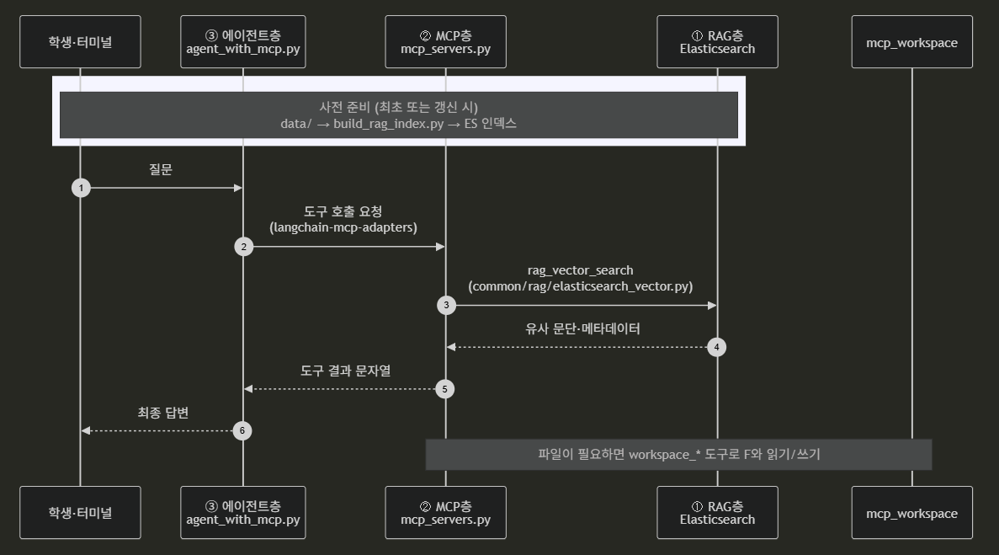
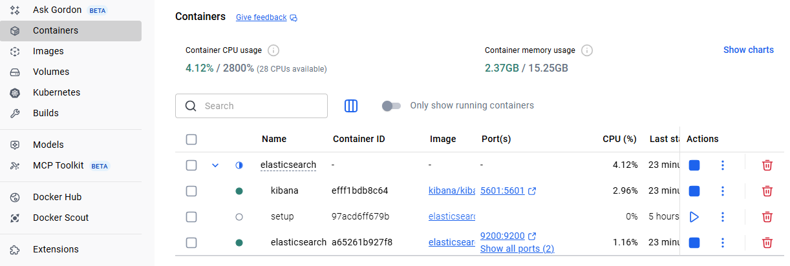
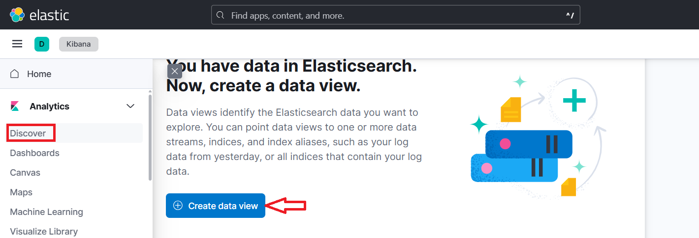
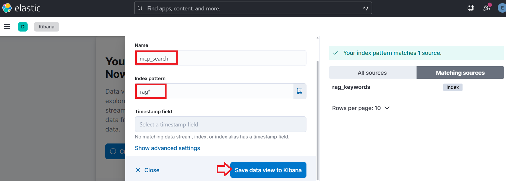
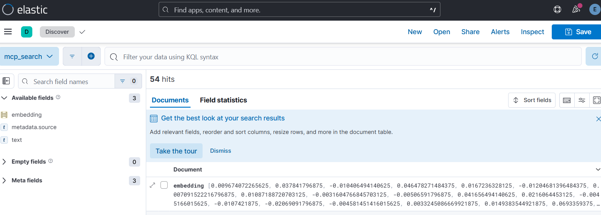
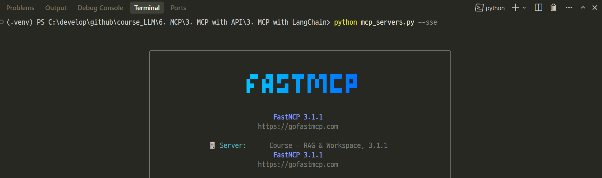
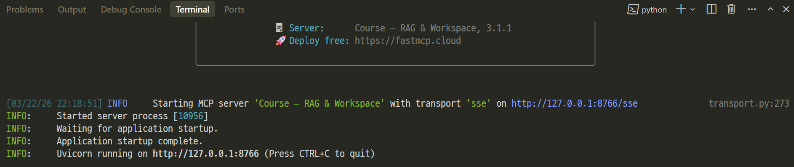
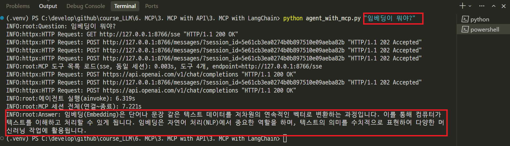

# MCP with LangChain — RAG·워크스페이스·에이전트

---
## 개념

| 구분 | 설명 |
|------|------|
| **RAG** | `data/` 텍스트를 임베딩해 Elasticsearch에 넣고, 질문과 비슷한 구절을 **벡터 검색**으로 찾습니다. |
| **MCP** | LLM이 직접 DB·파일에 접속하지 않고, **표준화된 “도구 서버”**에 요청합니다. 여기서는 검색·파일 I/O가 MCP 도구로 노출됩니다. |
| **Agent** | 사용자 말을 이해하고 **어떤 도구를 호출할지** 정한 뒤, 결과를 바탕으로 답을 만듭니다. (`langchain.agents.create_agent`) |

> 강의 계획에서 말하는 **Agent(도구 호출) Layer**은 `agent_with_mcp.py`에서 `create_agent`로 구현합니다.

---

## 아키텍처


---
1. **RAG Layer**  
   - `data/`: 용어·설명 텍스트 (`rag-keywords.txt`, `web-keywords.txt` 등)  
   - `elasticsearch/`: Docker로 ES·Kibana 실행  
   - `common/rag/elasticsearch_vector.py`: ES에 대한 **유사도 검색** 래퍼  

2. **MCP Layer**  
   - `mcp_servers.py`: FastMCP로 만든 MCP 서버(RAG·워크스페이스 도구). **SSE·Streamable HTTP**로 상시 띄우거나, **stdio**로만 실행할 수 있음  
   - RAG 검색 도구 + `mcp_workspace/` 안에서만 동작하는 파일 도구  

3. **Agent Layer**  
   - `agent_with_mcp.py`: 기본은 **이미 떠 있는 MCP 서버(URL)** 에 붙여 도구를 쓴다. `MCP_USE_STDIO=1`일 때만 `mcp_servers.py`를 **자식 프로세스(stdio)** 로 띄운다  

---
## 사용 라이브러리 (`requirements.txt`)
- **Python**: 3.13 권장
- **langchain**, **langchain-openai**: 채팅 모델·에이전트  
- **langchain-mcp-adapters**: MCP 서버와 연결해 LangChain **Tool**로 변환  
- **elasticsearch**: 인덱스 구축·검색 클라이언트  
- **fastmcp**, **mcp**: MCP 서버 구현·프로토콜  
- **python-dotenv**: `.env` 로드  

---
## 실행 순서 (중요)

---
### 1단계: Elasticsearch 기동

```bash
cd elasticsearch
docker-compose up -d
```

헬스 확인 예시:

```bash
curl -u elastic:changeme123! http://localhost:9200/_cluster/health
```

자세한 설명은 `elasticsearch/README.md`를 참고합니다.

---


---
### 2단계: RAG 인덱스 구축

프로젝트 루트로 돌아와:

```bash
python build_rag_index.py --recreate
```

- `data/`의 지정 파일을 잘라서 임베딩 후 `RAG_INDEX_NAME` 인덱스에 넣습니다.  
- 처음이거나 매핑을 바꿨을 때는 `--recreate`로 인덱스를 다시 만듭니다.

---
- [로그인 페이지](http://localhost:5601)
- `Username`: elastic & `Password`: changeme123!



---


---


---
### 3단계: MCP 서버 상시 기동 (권장)

에이전트(`agent_with_mcp.py`)는 **기본적으로 URL로 MCP 서버에 접속**합니다. 질문할 때마다 서버 프로세스를 새로 띄우지 않으려면, **별도 터미널을 하나 두고 서버를 계속 실행**해 둡니다.

**터미널 A — SSE (기본과 맞추기 쉬움)**

```bash
python mcp_servers.py --sse
```


---
> 로그에 `http://127.0.0.1:8766/sse` 형태로 주소가 나오면 정상입니다. `.env`의 `MCP_CLIENT_TRANSPORT`는 기본값 `sse`를 그대로 두면 됩니다.



---
**터미널 A — Streamable HTTP (대안)**

```bash
python mcp_servers.py --streamable-http
```

이 경우 에이전트 쪽 `.env`에 다음을 맞춥니다.

```env
MCP_CLIENT_TRANSPORT=streamable-http
```

---
포트·호스트는 `MCP_HTTP_HOST`, `MCP_HTTP_PORT`(기본 `127.0.0.1`, `8766`)로 서버·클라이언트 **양쪽**에서 동일하게 둡니다. 경로를 바꿨다면 `MCP_SSE_PATH` / `MCP_STREAMABLE_HTTP_PATH` 또는 전체 URL(`MCP_SSE_URL`, `MCP_STREAMABLE_HTTP_URL`)로 서버와 에이전트가 **같은 엔드포인트**를 보도록 맞춥니다.

추가 옵션:

- `python mcp_servers.py --http` — FastMCP의 `http` 전송(필요 시 사용)
- 경로 덮어쓰기: 서버 실행 전 환경변수 `MCP_SSE_PATH`, `MCP_STREAMABLE_HTTP_PATH`(비우면 FastMCP 기본 경로 사용)

---
### 4단계: 에이전트 실행

**터미널 B**에서 질문을 **명령줄 인자**로 넘깁니다. 에이전트가 필요하면 **MCP 도구**를 호출합니다.

```bash
python agent_with_mcp.py "임베딩이 뭐야?"
```
> 인자 없이 실행하면 사용법(서버 기동 안내 포함)이 표시됩니다.



---
## MCP 서버만 단독 실행 (IDE·다른 클라이언트 연동)

에이전트 없이 MCP 프로토콜로만 서버를 띄울 때:

| 명령 | 설명 |
|------|------|
| `python mcp_servers.py` | **stdio** MCP (Cursor 등에서 subprocess로 붙일 때) |
| `python mcp_servers.py --sse` | **SSE** HTTP 서버 (상시 + `agent_with_mcp.py` 기본) |
| `python mcp_servers.py --streamable-http` | **Streamable HTTP** |
| `python mcp_servers.py --http` | FastMCP **http** 전송 |

> 바인딩은 `MCP_HTTP_HOST`, `MCP_HTTP_PORT`로 조정합니다.
